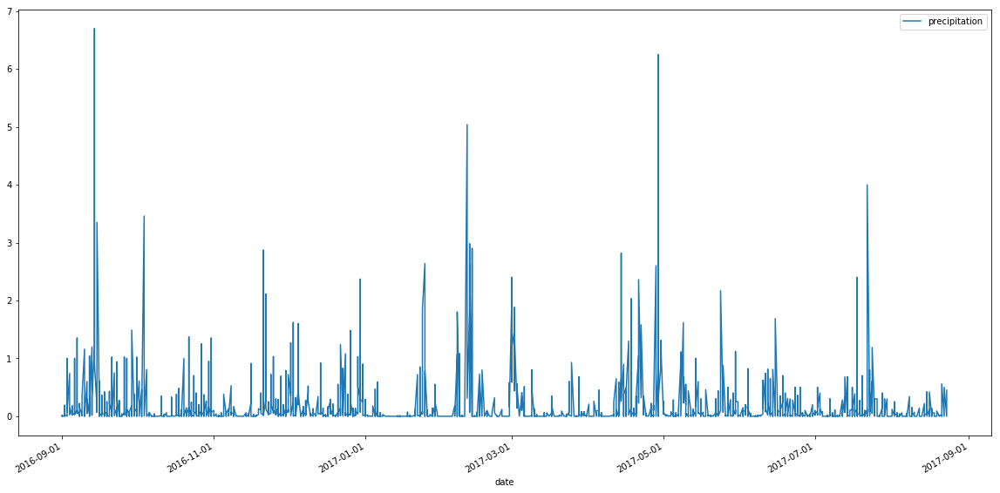
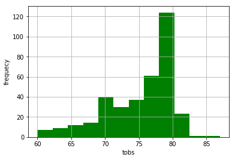
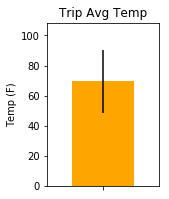

```python
import pandas as pd
import matplotlib.pylab as plt
import matplotlib.dates as mdates
from sqlalchemy import create_engine
```


```python
engine = create_engine("sqlite:///hawaii.sqlite", echo = False)
conn = engine.connect()
```


```python
# Precipitation Analysis
prec = pd.read_sql('measurements', conn, parse_dates={'date': {'format': '%Y-%m-%d'}}, columns=['date', 'prcp'])
```


```python
# Get last 12 months
prec['month'] = prec.date.map(lambda x: x.strftime('%m')).astype('Int64')
prec['year'] = prec.date.map(lambda x: x.strftime('%Y')).astype('Int64')
prec['month_year'] = prec['year']*100 + prec['month']
# Rank month_year by Desc
prec = prec.sort_values(by='month_year', ascending=False).reset_index(drop = True)
target = prec.month_year.unique()[0:12]
prec = prec[prec['month_year'].astype(str).str.contains('|'.join(target.astype('str')))][['date', 'prcp']]
```


```python
prec.shape
```


    (1968, 2)


```python
prec.set_index('date', inplace = True)
```


```python
prec.columns = ['precipitation']
```


```python
ax = prec.plot(figsize = (20, 10))
ax.xaxis.set_major_formatter(mdates.DateFormatter('%Y-%m-%d'))
plt.show()
```





```python
prec.describe()
```


<div>
<style scoped>
    .dataframe tbody tr th:only-of-type {
        vertical-align: middle;
    }

    .dataframe tbody tr th {
        vertical-align: top;
    }

    .dataframe thead th {
        text-align: right;
    }
</style>
<table border="1" class="dataframe">
  <thead>
    <tr style="text-align: right;">
      <th></th>
      <th>precipitation</th>
    </tr>
  </thead>
  <tbody>
    <tr>
      <th>count</th>
      <td>1968.000000</td>
    </tr>
    <tr>
      <th>mean</th>
      <td>0.171479</td>
    </tr>
    <tr>
      <th>std</th>
      <td>0.451817</td>
    </tr>
    <tr>
      <th>min</th>
      <td>0.000000</td>
    </tr>
    <tr>
      <th>25%</th>
      <td>0.000000</td>
    </tr>
    <tr>
      <th>50%</th>
      <td>0.020000</td>
    </tr>
    <tr>
      <th>75%</th>
      <td>0.130000</td>
    </tr>
    <tr>
      <th>max</th>
      <td>6.700000</td>
    </tr>
  </tbody>
</table>
</div>


```python
# Count total number of stations
print('# of Unique Stations:', conn.execute('SELECT COUNT(DISTINCT(station)) FROM stations').fetchall()[0][0])
```

    # of Unique Stations: 9
    


```python
# List the stations and observation counts in descending order
conn.execute('SELECT station, SUM(tobs) \
              FROM measurements  \
              GROUP BY station \
              ORDER BY SUM(tobs) DESC').fetchall()
```


    [('USC00519397', 200205),
     ('USC00519281', 198652),
     ('USC00513117', 195940),
     ('USC00519523', 191698),
     ('USC00516128', 176029),
     ('USC00514830', 144913),
     ('USC00511918', 138191),
     ('USC00517948', 50943),
     ('USC00518838', 24855)]


```python
# Which station has the highest number of observations?
print('Station with highest tobs:', conn.execute('SELECT station, SUM(tobs) \
              FROM measurements  \
              GROUP BY station \
              ORDER BY SUM(tobs) DESC').fetchall()[0][0])
```

    Station with highest tobs: USC00519397
    


```python
conn.execute('SELECT MAX(date) FROM measurements').fetchall()[0][0]
```


    '2017-08-23'


```python
data = conn.execute("SELECT station, date, SUM(tobs) \
                     FROM measurements \
                     WHERE date >= '2016-08-23' AND station == 'USC00519397' \
                     GROUP BY station, date").fetchall()
data = pd.DataFrame(data)
data.columns = ['station', 'date', 'tobs']
```


```python
plt.hist(data['tobs'], bins = 12, color = 'green')
plt.xlabel('tobs')
plt.ylabel('frequecy')
plt.grid()
```





```python
tobs = pd.read_sql('measurements', conn, parse_dates={'date': {'format': '%Y-%m-%d'}}, columns=['date', 'tobs'])
```


```python
# Write a function called calc_temps that will accept a start date and end date in the format %Y-%m-%d 
# and return the minimum, average, and maximum temperatures for that range of dates.
def calc_temps(start, end):
    df = tobs[(tobs.date >= start) & (tobs.date <= end)]
    dic = {}
    dic['min'] = df.tobs.min()
    dic['avg'] = df.tobs.mean()
    dic['max'] = df.tobs.max()
    return(dic)

start_date = '2017-02-01'
end_date = '2017-02-15'

temps = calc_temps(start_date, end_date)
```


```python
plt.figure(figsize=(2,3))
plt.margins(.4,.2)
plt.bar(0, height = temps['avg'], tick_label = '', yerr = temps['max'] - temps['min'], color = 'orange')
plt.title('Trip Avg Temp')
plt.ylabel('Temp (F)')
plt.show()
```




