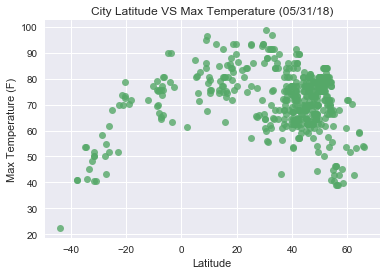
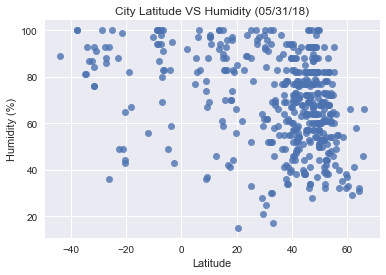
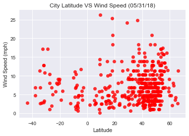

# Observable Trends

## 1. As we get closer to the equator, maximum temperature increases. 
## 2. As we get closer to the equator, wind speed tend to decrease.
## 3. As we get closer to the equator, humidity tend to increase.


```python
import requests
import random
import json
import os
import pandas as pd
import matplotlib.pyplot as plt
import seaborn as sns
```


```python
# Create empty list for parameters
city_name = []
city_id = []
lat = []
lon = []
temp = []
humidity = []
cloudiness = []
wind_speed = []

# 209579 cities, take 501 randomly
direc = os.path.join(os.getcwd(), 'city_data', 'city.list.json')
idx = list(range(0, 209579, 419))
print(len(idx), 'cities')
i = 1
with open(direc, encoding="utf8") as json_data:
    d = json.load(json_data)
    for ind in idx:
        citi_id = d[ind]['id']
        key = 'ddc436ee9dbe3cb69eb765d428a17974'
        url = 'http://api.openweathermap.org/data/2.5/weather?units=Imperial&id='+str(citi_id)+'&APPID='+key 
        res = requests.get(url)
        dat = res.json()
        city_name.append(dat['name'])
        city_id.append(dat['id'])
        temp.append(dat['main']['temp_max'])
        humidity.append(dat['main']['humidity'])
        cloudiness.append(dat['clouds']['all'])
        lat.append(dat['coord']['lat'])
        lon.append(dat['coord']['lon'])
        wind_speed.append(dat['wind']['speed'])
        print(str(i), dat['name'])
        print(url)
        i+=1
```

    501 cities
    1 Hurzuf
    http://api.openweathermap.org/data/2.5/weather?units=Imperial&id=707860&APPID=ddc436ee9dbe3cb69eb765d428a17974
    2 Orta Nova
    http://api.openweathermap.org/data/2.5/weather?units=Imperial&id=6541936&APPID=ddc436ee9dbe3cb69eb765d428a17974
    3 Pipri
    http://api.openweathermap.org/data/2.5/weather?units=Imperial&id=1259552&APPID=ddc436ee9dbe3cb69eb765d428a17974
    4 Scheibbs
    http://api.openweathermap.org/data/2.5/weather?units=Imperial&id=2766080&APPID=ddc436ee9dbe3cb69eb765d428a17974
    5 Allenton
    http://api.openweathermap.org/data/2.5/weather?units=Imperial&id=6217203&APPID=ddc436ee9dbe3cb69eb765d428a17974
    6 Ūrāyin-e ‘Ulyā
    http://api.openweathermap.org/data/2.5/weather?units=Imperial&id=1121941&APPID=ddc436ee9dbe3cb69eb765d428a17974
    7 Snowdrift
    http://api.openweathermap.org/data/2.5/weather?units=Imperial&id=6943716&APPID=ddc436ee9dbe3cb69eb765d428a17974
    8 City and Borough of Birmingham
    http://api.openweathermap.org/data/2.5/weather?units=Imperial&id=3333125&APPID=ddc436ee9dbe3cb69eb765d428a17974
    9 Trento
    http://api.openweathermap.org/data/2.5/weather?units=Imperial&id=6541469&APPID=ddc436ee9dbe3cb69eb765d428a17974
    10 Stahnsdorf
    http://api.openweathermap.org/data/2.5/weather?units=Imperial&id=6547684&APPID=ddc436ee9dbe3cb69eb765d428a17974
    11 Bohme
    http://api.openweathermap.org/data/2.5/weather?units=Imperial&id=2946952&APPID=ddc436ee9dbe3cb69eb765d428a17974
    12 Rothrist
    http://api.openweathermap.org/data/2.5/weather?units=Imperial&id=7286962&APPID=ddc436ee9dbe3cb69eb765d428a17974
    13 Mongar Dzongkhag
    http://api.openweathermap.org/data/2.5/weather?units=Imperial&id=1337285&APPID=ddc436ee9dbe3cb69eb765d428a17974
    14 Congonhas
    http://api.openweathermap.org/data/2.5/weather?units=Imperial&id=3465671&APPID=ddc436ee9dbe3cb69eb765d428a17974
    15 Litherland
    http://api.openweathermap.org/data/2.5/weather?units=Imperial&id=2644386&APPID=ddc436ee9dbe3cb69eb765d428a17974
    16 Tirumala
    http://api.openweathermap.org/data/2.5/weather?units=Imperial&id=1254373&APPID=ddc436ee9dbe3cb69eb765d428a17974
    17 Nohar
    http://api.openweathermap.org/data/2.5/weather?units=Imperial&id=1261234&APPID=ddc436ee9dbe3cb69eb765d428a17974
    18 Ohara
    http://api.openweathermap.org/data/2.5/weather?units=Imperial&id=2111495&APPID=ddc436ee9dbe3cb69eb765d428a17974
    19 San Narciso
    http://api.openweathermap.org/data/2.5/weather?units=Imperial&id=1688912&APPID=ddc436ee9dbe3cb69eb765d428a17974
    20 Bayramaly
    http://api.openweathermap.org/data/2.5/weather?units=Imperial&id=1219762&APPID=ddc436ee9dbe3cb69eb765d428a17974
    21 Dasht-e Archi
    http://api.openweathermap.org/data/2.5/weather?units=Imperial&id=1143838&APPID=ddc436ee9dbe3cb69eb765d428a17974
    22 Ibarreta
    http://api.openweathermap.org/data/2.5/weather?units=Imperial&id=3433513&APPID=ddc436ee9dbe3cb69eb765d428a17974
    23 Weinburg
    http://api.openweathermap.org/data/2.5/weather?units=Imperial&id=7871895&APPID=ddc436ee9dbe3cb69eb765d428a17974
    24 Schwarzau im Schwarzautal
    http://api.openweathermap.org/data/2.5/weather?units=Imperial&id=7873385&APPID=ddc436ee9dbe3cb69eb765d428a17974
    25 Pinggau
    http://api.openweathermap.org/data/2.5/weather?units=Imperial&id=7872358&APPID=ddc436ee9dbe3cb69eb765d428a17974
    26 Loruns
    http://api.openweathermap.org/data/2.5/weather?units=Imperial&id=2772254&APPID=ddc436ee9dbe3cb69eb765d428a17974
    27 Hinterbrühl
    http://api.openweathermap.org/data/2.5/weather?units=Imperial&id=7871853&APPID=ddc436ee9dbe3cb69eb765d428a17974
    28 Chernyshevskiy
    http://api.openweathermap.org/data/2.5/weather?units=Imperial&id=2025456&APPID=ddc436ee9dbe3cb69eb765d428a17974
    29 Bratovshchina
    http://api.openweathermap.org/data/2.5/weather?units=Imperial&id=571719&APPID=ddc436ee9dbe3cb69eb765d428a17974
    30 Région du Tibesti
    http://api.openweathermap.org/data/2.5/weather?units=Imperial&id=7603258&APPID=ddc436ee9dbe3cb69eb765d428a17974
    31 Gries
    http://api.openweathermap.org/data/2.5/weather?units=Imperial&id=6555098&APPID=ddc436ee9dbe3cb69eb765d428a17974
    32 Miyamaechō
    http://api.openweathermap.org/data/2.5/weather?units=Imperial&id=1856764&APPID=ddc436ee9dbe3cb69eb765d428a17974
    33 Regensburg
    http://api.openweathermap.org/data/2.5/weather?units=Imperial&id=2849483&APPID=ddc436ee9dbe3cb69eb765d428a17974
    34 Naẕerat ‘Illit
    http://api.openweathermap.org/data/2.5/weather?units=Imperial&id=294097&APPID=ddc436ee9dbe3cb69eb765d428a17974
    35 Brochette
    http://api.openweathermap.org/data/2.5/weather?units=Imperial&id=3729045&APPID=ddc436ee9dbe3cb69eb765d428a17974
    36 Formiga
    http://api.openweathermap.org/data/2.5/weather?units=Imperial&id=3463174&APPID=ddc436ee9dbe3cb69eb765d428a17974
    37 Pozoblanco
    http://api.openweathermap.org/data/2.5/weather?units=Imperial&id=6357249&APPID=ddc436ee9dbe3cb69eb765d428a17974
    38 Grande-Synthe
    http://api.openweathermap.org/data/2.5/weather?units=Imperial&id=6438266&APPID=ddc436ee9dbe3cb69eb765d428a17974
    39 Mamou
    http://api.openweathermap.org/data/2.5/weather?units=Imperial&id=2417833&APPID=ddc436ee9dbe3cb69eb765d428a17974
    40 Magenta
    http://api.openweathermap.org/data/2.5/weather?units=Imperial&id=6536515&APPID=ddc436ee9dbe3cb69eb765d428a17974
    41 Gemeente IJsselstein
    http://api.openweathermap.org/data/2.5/weather?units=Imperial&id=2753354&APPID=ddc436ee9dbe3cb69eb765d428a17974
    42 Kaeng Khro
    http://api.openweathermap.org/data/2.5/weather?units=Imperial&id=1610505&APPID=ddc436ee9dbe3cb69eb765d428a17974
    43 New Philadelphia
    http://api.openweathermap.org/data/2.5/weather?units=Imperial&id=5164390&APPID=ddc436ee9dbe3cb69eb765d428a17974
    44 Ohafia-Ifigh
    http://api.openweathermap.org/data/2.5/weather?units=Imperial&id=2327494&APPID=ddc436ee9dbe3cb69eb765d428a17974
    45 Sokolovyy
    http://api.openweathermap.org/data/2.5/weather?units=Imperial&id=491155&APPID=ddc436ee9dbe3cb69eb765d428a17974
    46 Mirnyy
    http://api.openweathermap.org/data/2.5/weather?units=Imperial&id=526347&APPID=ddc436ee9dbe3cb69eb765d428a17974
    47 Gorodoviki
    http://api.openweathermap.org/data/2.5/weather?units=Imperial&id=559478&APPID=ddc436ee9dbe3cb69eb765d428a17974
    48 Yagunovskiy
    http://api.openweathermap.org/data/2.5/weather?units=Imperial&id=1486525&APPID=ddc436ee9dbe3cb69eb765d428a17974
    49 Paterna del Río
    http://api.openweathermap.org/data/2.5/weather?units=Imperial&id=6355585&APPID=ddc436ee9dbe3cb69eb765d428a17974
    50 Chelokhovo
    http://api.openweathermap.org/data/2.5/weather?units=Imperial&id=567866&APPID=ddc436ee9dbe3cb69eb765d428a17974
    51 Khoduzhets
    http://api.openweathermap.org/data/2.5/weather?units=Imperial&id=549904&APPID=ddc436ee9dbe3cb69eb765d428a17974
    52 Setun’
    http://api.openweathermap.org/data/2.5/weather?units=Imperial&id=496456&APPID=ddc436ee9dbe3cb69eb765d428a17974
    53 Makarely
    http://api.openweathermap.org/data/2.5/weather?units=Imperial&id=532264&APPID=ddc436ee9dbe3cb69eb765d428a17974
    54 Llano de Bureba
    http://api.openweathermap.org/data/2.5/weather?units=Imperial&id=6356479&APPID=ddc436ee9dbe3cb69eb765d428a17974
    55 Lukino
    http://api.openweathermap.org/data/2.5/weather?units=Imperial&id=533475&APPID=ddc436ee9dbe3cb69eb765d428a17974
    56 Nechaikha
    http://api.openweathermap.org/data/2.5/weather?units=Imperial&id=6608093&APPID=ddc436ee9dbe3cb69eb765d428a17974
    57 Kuznetsovo
    http://api.openweathermap.org/data/2.5/weather?units=Imperial&id=537675&APPID=ddc436ee9dbe3cb69eb765d428a17974
    58 Divnomorskoye
    http://api.openweathermap.org/data/2.5/weather?units=Imperial&id=566157&APPID=ddc436ee9dbe3cb69eb765d428a17974
    59 Kushchevskaya
    http://api.openweathermap.org/data/2.5/weather?units=Imperial&id=538416&APPID=ddc436ee9dbe3cb69eb765d428a17974
    60 Ufa
    http://api.openweathermap.org/data/2.5/weather?units=Imperial&id=479561&APPID=ddc436ee9dbe3cb69eb765d428a17974
    61 Hvardiys’ke
    http://api.openweathermap.org/data/2.5/weather?units=Imperial&id=707777&APPID=ddc436ee9dbe3cb69eb765d428a17974
    62 Lugovoye
    http://api.openweathermap.org/data/2.5/weather?units=Imperial&id=533601&APPID=ddc436ee9dbe3cb69eb765d428a17974
    63 Alachua County
    http://api.openweathermap.org/data/2.5/weather?units=Imperial&id=4145709&APPID=ddc436ee9dbe3cb69eb765d428a17974
    64 Inland
    http://api.openweathermap.org/data/2.5/weather?units=Imperial&id=5983310&APPID=ddc436ee9dbe3cb69eb765d428a17974
    65 Killin
    http://api.openweathermap.org/data/2.5/weather?units=Imperial&id=4117436&APPID=ddc436ee9dbe3cb69eb765d428a17974
    66 Dickenson County
    http://api.openweathermap.org/data/2.5/weather?units=Imperial&id=4755865&APPID=ddc436ee9dbe3cb69eb765d428a17974
    67 Wanaque
    http://api.openweathermap.org/data/2.5/weather?units=Imperial&id=5106014&APPID=ddc436ee9dbe3cb69eb765d428a17974
    68 Chester
    http://api.openweathermap.org/data/2.5/weather?units=Imperial&id=5020988&APPID=ddc436ee9dbe3cb69eb765d428a17974
    69 Martigny
    http://api.openweathermap.org/data/2.5/weather?units=Imperial&id=7286444&APPID=ddc436ee9dbe3cb69eb765d428a17974
    70 Preston
    http://api.openweathermap.org/data/2.5/weather?units=Imperial&id=5061036&APPID=ddc436ee9dbe3cb69eb765d428a17974
    71 Pellingen
    http://api.openweathermap.org/data/2.5/weather?units=Imperial&id=2854999&APPID=ddc436ee9dbe3cb69eb765d428a17974
    72 Siethen
    http://api.openweathermap.org/data/2.5/weather?units=Imperial&id=2832320&APPID=ddc436ee9dbe3cb69eb765d428a17974
    73 Indian
    http://api.openweathermap.org/data/2.5/weather?units=Imperial&id=5864720&APPID=ddc436ee9dbe3cb69eb765d428a17974
    74 Aysha
    http://api.openweathermap.org/data/2.5/weather?units=Imperial&id=580167&APPID=ddc436ee9dbe3cb69eb765d428a17974
    75 North Beach Haven
    http://api.openweathermap.org/data/2.5/weather?units=Imperial&id=4503289&APPID=ddc436ee9dbe3cb69eb765d428a17974
    76 South Oxfordshire District
    http://api.openweathermap.org/data/2.5/weather?units=Imperial&id=2637349&APPID=ddc436ee9dbe3cb69eb765d428a17974
    77 Gemeente Castricum
    http://api.openweathermap.org/data/2.5/weather?units=Imperial&id=2757990&APPID=ddc436ee9dbe3cb69eb765d428a17974
    78 Zeven
    http://api.openweathermap.org/data/2.5/weather?units=Imperial&id=2804642&APPID=ddc436ee9dbe3cb69eb765d428a17974
    79 Massanova
    http://api.openweathermap.org/data/2.5/weather?units=Imperial&id=4771926&APPID=ddc436ee9dbe3cb69eb765d428a17974
    80 Paris 20 Ménilmontant
    http://api.openweathermap.org/data/2.5/weather?units=Imperial&id=2994540&APPID=ddc436ee9dbe3cb69eb765d428a17974
    81 Strydompark
    http://api.openweathermap.org/data/2.5/weather?units=Imperial&id=7870467&APPID=ddc436ee9dbe3cb69eb765d428a17974
    82 Haapavesi
    http://api.openweathermap.org/data/2.5/weather?units=Imperial&id=659557&APPID=ddc436ee9dbe3cb69eb765d428a17974
    83 Kstovo
    http://api.openweathermap.org/data/2.5/weather?units=Imperial&id=540103&APPID=ddc436ee9dbe3cb69eb765d428a17974
    84 Mironov
    http://api.openweathermap.org/data/2.5/weather?units=Imperial&id=526331&APPID=ddc436ee9dbe3cb69eb765d428a17974
    85 Volosovo
    http://api.openweathermap.org/data/2.5/weather?units=Imperial&id=472357&APPID=ddc436ee9dbe3cb69eb765d428a17974
    86 Berdyaush
    http://api.openweathermap.org/data/2.5/weather?units=Imperial&id=577450&APPID=ddc436ee9dbe3cb69eb765d428a17974
    87 Bamako
    http://api.openweathermap.org/data/2.5/weather?units=Imperial&id=2460596&APPID=ddc436ee9dbe3cb69eb765d428a17974
    88 Walton County
    http://api.openweathermap.org/data/2.5/weather?units=Imperial&id=4229371&APPID=ddc436ee9dbe3cb69eb765d428a17974
    89 Saraland
    http://api.openweathermap.org/data/2.5/weather?units=Imperial&id=4088628&APPID=ddc436ee9dbe3cb69eb765d428a17974
    90 La Clede
    http://api.openweathermap.org/data/2.5/weather?units=Imperial&id=4242425&APPID=ddc436ee9dbe3cb69eb765d428a17974
    91 North Brighton
    http://api.openweathermap.org/data/2.5/weather?units=Imperial&id=2207611&APPID=ddc436ee9dbe3cb69eb765d428a17974
    92 Yeppoon
    http://api.openweathermap.org/data/2.5/weather?units=Imperial&id=2142316&APPID=ddc436ee9dbe3cb69eb765d428a17974
    93 Hannaford
    http://api.openweathermap.org/data/2.5/weather?units=Imperial&id=2163972&APPID=ddc436ee9dbe3cb69eb765d428a17974
    94 Steiglitz
    http://api.openweathermap.org/data/2.5/weather?units=Imperial&id=2148406&APPID=ddc436ee9dbe3cb69eb765d428a17974
    95 Bobin
    http://api.openweathermap.org/data/2.5/weather?units=Imperial&id=2175127&APPID=ddc436ee9dbe3cb69eb765d428a17974
    96 Stroud
    http://api.openweathermap.org/data/2.5/weather?units=Imperial&id=2148052&APPID=ddc436ee9dbe3cb69eb765d428a17974
    97 Cunderdin
    http://api.openweathermap.org/data/2.5/weather?units=Imperial&id=2073354&APPID=ddc436ee9dbe3cb69eb765d428a17974
    98 Burekup
    http://api.openweathermap.org/data/2.5/weather?units=Imperial&id=2075350&APPID=ddc436ee9dbe3cb69eb765d428a17974
    99 Wongamine
    http://api.openweathermap.org/data/2.5/weather?units=Imperial&id=2058007&APPID=ddc436ee9dbe3cb69eb765d428a17974
    100 Moorland
    http://api.openweathermap.org/data/2.5/weather?units=Imperial&id=2156992&APPID=ddc436ee9dbe3cb69eb765d428a17974
    101 Empire Vale
    http://api.openweathermap.org/data/2.5/weather?units=Imperial&id=2167390&APPID=ddc436ee9dbe3cb69eb765d428a17974
    102 Coolabah
    http://api.openweathermap.org/data/2.5/weather?units=Imperial&id=2170654&APPID=ddc436ee9dbe3cb69eb765d428a17974
    103 Heyin
    http://api.openweathermap.org/data/2.5/weather?units=Imperial&id=1808204&APPID=ddc436ee9dbe3cb69eb765d428a17974
    104 Usuki
    http://api.openweathermap.org/data/2.5/weather?units=Imperial&id=1849094&APPID=ddc436ee9dbe3cb69eb765d428a17974
    105 Ahmadnagar
    http://api.openweathermap.org/data/2.5/weather?units=Imperial&id=1279228&APPID=ddc436ee9dbe3cb69eb765d428a17974
    106 Grenoble
    http://api.openweathermap.org/data/2.5/weather?units=Imperial&id=3014728&APPID=ddc436ee9dbe3cb69eb765d428a17974
    107 Soulier
    http://api.openweathermap.org/data/2.5/weather?units=Imperial&id=2974020&APPID=ddc436ee9dbe3cb69eb765d428a17974
    108 Courseulles-sur-Mer
    http://api.openweathermap.org/data/2.5/weather?units=Imperial&id=6427168&APPID=ddc436ee9dbe3cb69eb765d428a17974
    109 Aigueblanche
    http://api.openweathermap.org/data/2.5/weather?units=Imperial&id=6452505&APPID=ddc436ee9dbe3cb69eb765d428a17974
    110 Desges
    http://api.openweathermap.org/data/2.5/weather?units=Imperial&id=6449058&APPID=ddc436ee9dbe3cb69eb765d428a17974
    111 La Mesnière
    http://api.openweathermap.org/data/2.5/weather?units=Imperial&id=3008168&APPID=ddc436ee9dbe3cb69eb765d428a17974
    112 Verneix
    http://api.openweathermap.org/data/2.5/weather?units=Imperial&id=2969827&APPID=ddc436ee9dbe3cb69eb765d428a17974
    113 Montazeau
    http://api.openweathermap.org/data/2.5/weather?units=Imperial&id=6429453&APPID=ddc436ee9dbe3cb69eb765d428a17974
    114 Etsaut
    http://api.openweathermap.org/data/2.5/weather?units=Imperial&id=3019340&APPID=ddc436ee9dbe3cb69eb765d428a17974
    115 Alleuze
    http://api.openweathermap.org/data/2.5/weather?units=Imperial&id=6452149&APPID=ddc436ee9dbe3cb69eb765d428a17974
    116 Lempty
    http://api.openweathermap.org/data/2.5/weather?units=Imperial&id=6440065&APPID=ddc436ee9dbe3cb69eb765d428a17974
    117 Saint-Agnan-le-Malherbe
    http://api.openweathermap.org/data/2.5/weather?units=Imperial&id=2981912&APPID=ddc436ee9dbe3cb69eb765d428a17974
    118 Savignac-Lédrier
    http://api.openweathermap.org/data/2.5/weather?units=Imperial&id=6429641&APPID=ddc436ee9dbe3cb69eb765d428a17974
    119 Villenave-de-Rions
    http://api.openweathermap.org/data/2.5/weather?units=Imperial&id=6432501&APPID=ddc436ee9dbe3cb69eb765d428a17974
    120 Labastide
    http://api.openweathermap.org/data/2.5/weather?units=Imperial&id=3011292&APPID=ddc436ee9dbe3cb69eb765d428a17974
    121 Argouges
    http://api.openweathermap.org/data/2.5/weather?units=Imperial&id=6449450&APPID=ddc436ee9dbe3cb69eb765d428a17974
    122 Eugénie-les-Bains
    http://api.openweathermap.org/data/2.5/weather?units=Imperial&id=6448893&APPID=ddc436ee9dbe3cb69eb765d428a17974
    123 Belval
    http://api.openweathermap.org/data/2.5/weather?units=Imperial&id=6449469&APPID=ddc436ee9dbe3cb69eb765d428a17974
    124 Saint-Denis-le-Gast
    http://api.openweathermap.org/data/2.5/weather?units=Imperial&id=2980881&APPID=ddc436ee9dbe3cb69eb765d428a17974
    125 La Genevraie
    http://api.openweathermap.org/data/2.5/weather?units=Imperial&id=3009124&APPID=ddc436ee9dbe3cb69eb765d428a17974
    126 Ardore
    http://api.openweathermap.org/data/2.5/weather?units=Imperial&id=6539857&APPID=ddc436ee9dbe3cb69eb765d428a17974
    127 San Vito al Tagliamento
    http://api.openweathermap.org/data/2.5/weather?units=Imperial&id=6539332&APPID=ddc436ee9dbe3cb69eb765d428a17974
    128 Bulaevo
    http://api.openweathermap.org/data/2.5/weather?units=Imperial&id=1525014&APPID=ddc436ee9dbe3cb69eb765d428a17974
    129 Arcos
    http://api.openweathermap.org/data/2.5/weather?units=Imperial&id=8010722&APPID=ddc436ee9dbe3cb69eb765d428a17974
    130 Malveira
    http://api.openweathermap.org/data/2.5/weather?units=Imperial&id=8012535&APPID=ddc436ee9dbe3cb69eb765d428a17974
    131 Furadouro
    http://api.openweathermap.org/data/2.5/weather?units=Imperial&id=8011816&APPID=ddc436ee9dbe3cb69eb765d428a17974
    132 Paramos
    http://api.openweathermap.org/data/2.5/weather?units=Imperial&id=8010768&APPID=ddc436ee9dbe3cb69eb765d428a17974
    133 Travassós
    http://api.openweathermap.org/data/2.5/weather?units=Imperial&id=2733396&APPID=ddc436ee9dbe3cb69eb765d428a17974
    134 Macieira da Lixa
    http://api.openweathermap.org/data/2.5/weather?units=Imperial&id=8014552&APPID=ddc436ee9dbe3cb69eb765d428a17974
    135 Ano Syros
    http://api.openweathermap.org/data/2.5/weather?units=Imperial&id=264839&APPID=ddc436ee9dbe3cb69eb765d428a17974
    136 Foggathorpe
    http://api.openweathermap.org/data/2.5/weather?units=Imperial&id=2649264&APPID=ddc436ee9dbe3cb69eb765d428a17974
    137 Doaktown
    http://api.openweathermap.org/data/2.5/weather?units=Imperial&id=6943731&APPID=ddc436ee9dbe3cb69eb765d428a17974
    138 Kamouraska
    http://api.openweathermap.org/data/2.5/weather?units=Imperial&id=6325493&APPID=ddc436ee9dbe3cb69eb765d428a17974
    139 Lac-Etchemin
    http://api.openweathermap.org/data/2.5/weather?units=Imperial&id=6945981&APPID=ddc436ee9dbe3cb69eb765d428a17974
    140 Pierceland
    http://api.openweathermap.org/data/2.5/weather?units=Imperial&id=6104287&APPID=ddc436ee9dbe3cb69eb765d428a17974
    141 Victoria Cove
    http://api.openweathermap.org/data/2.5/weather?units=Imperial&id=6174055&APPID=ddc436ee9dbe3cb69eb765d428a17974
    142 Kincaid
    http://api.openweathermap.org/data/2.5/weather?units=Imperial&id=5992138&APPID=ddc436ee9dbe3cb69eb765d428a17974
    143 Asuncion Ocotlan
    http://api.openweathermap.org/data/2.5/weather?units=Imperial&id=3532655&APPID=ddc436ee9dbe3cb69eb765d428a17974
    144 Santa Rosalia
    http://api.openweathermap.org/data/2.5/weather?units=Imperial&id=3983805&APPID=ddc436ee9dbe3cb69eb765d428a17974
    145 Mazatlan
    http://api.openweathermap.org/data/2.5/weather?units=Imperial&id=3523412&APPID=ddc436ee9dbe3cb69eb765d428a17974
    146 Fajardo Municipio
    http://api.openweathermap.org/data/2.5/weather?units=Imperial&id=4564949&APPID=ddc436ee9dbe3cb69eb765d428a17974
    147 Burach
    http://api.openweathermap.org/data/2.5/weather?units=Imperial&id=2941605&APPID=ddc436ee9dbe3cb69eb765d428a17974
    148 Dobbertin
    http://api.openweathermap.org/data/2.5/weather?units=Imperial&id=2936683&APPID=ddc436ee9dbe3cb69eb765d428a17974
    149 Landkreis Calw
    http://api.openweathermap.org/data/2.5/weather?units=Imperial&id=2940384&APPID=ddc436ee9dbe3cb69eb765d428a17974
    150 Toging am Inn
    http://api.openweathermap.org/data/2.5/weather?units=Imperial&id=2821963&APPID=ddc436ee9dbe3cb69eb765d428a17974
    151 Lahnstein
    http://api.openweathermap.org/data/2.5/weather?units=Imperial&id=2881889&APPID=ddc436ee9dbe3cb69eb765d428a17974
    152 Cambs
    http://api.openweathermap.org/data/2.5/weather?units=Imperial&id=6548341&APPID=ddc436ee9dbe3cb69eb765d428a17974
    153 Ödmühl
    http://api.openweathermap.org/data/2.5/weather?units=Imperial&id=2858007&APPID=ddc436ee9dbe3cb69eb765d428a17974
    154 Süderwöhrden
    http://api.openweathermap.org/data/2.5/weather?units=Imperial&id=2825057&APPID=ddc436ee9dbe3cb69eb765d428a17974
    155 Vorsfelde
    http://api.openweathermap.org/data/2.5/weather?units=Imperial&id=3208628&APPID=ddc436ee9dbe3cb69eb765d428a17974
    156 Kleinmoor
    http://api.openweathermap.org/data/2.5/weather?units=Imperial&id=2888481&APPID=ddc436ee9dbe3cb69eb765d428a17974
    157 Laußig
    http://api.openweathermap.org/data/2.5/weather?units=Imperial&id=6548742&APPID=ddc436ee9dbe3cb69eb765d428a17974
    158 Pemfling
    http://api.openweathermap.org/data/2.5/weather?units=Imperial&id=6556634&APPID=ddc436ee9dbe3cb69eb765d428a17974
    159 Ottensen
    http://api.openweathermap.org/data/2.5/weather?units=Imperial&id=2856075&APPID=ddc436ee9dbe3cb69eb765d428a17974
    160 Anderbeck
    http://api.openweathermap.org/data/2.5/weather?units=Imperial&id=2956234&APPID=ddc436ee9dbe3cb69eb765d428a17974
    161 Hadamar
    http://api.openweathermap.org/data/2.5/weather?units=Imperial&id=2912829&APPID=ddc436ee9dbe3cb69eb765d428a17974
    162 Wunschenberg
    http://api.openweathermap.org/data/2.5/weather?units=Imperial&id=2805776&APPID=ddc436ee9dbe3cb69eb765d428a17974
    163 Helmershausen
    http://api.openweathermap.org/data/2.5/weather?units=Imperial&id=2906726&APPID=ddc436ee9dbe3cb69eb765d428a17974
    164 Achtrup
    http://api.openweathermap.org/data/2.5/weather?units=Imperial&id=2959621&APPID=ddc436ee9dbe3cb69eb765d428a17974
    165 Seukendorf
    http://api.openweathermap.org/data/2.5/weather?units=Imperial&id=2832871&APPID=ddc436ee9dbe3cb69eb765d428a17974
    166 Elbitz
    http://api.openweathermap.org/data/2.5/weather?units=Imperial&id=2931242&APPID=ddc436ee9dbe3cb69eb765d428a17974
    167 Otzing
    http://api.openweathermap.org/data/2.5/weather?units=Imperial&id=6547502&APPID=ddc436ee9dbe3cb69eb765d428a17974
    168 Lindflur
    http://api.openweathermap.org/data/2.5/weather?units=Imperial&id=2877201&APPID=ddc436ee9dbe3cb69eb765d428a17974
    169 Elberfeld
    http://api.openweathermap.org/data/2.5/weather?units=Imperial&id=2931276&APPID=ddc436ee9dbe3cb69eb765d428a17974
    170 Buchenbeuren
    http://api.openweathermap.org/data/2.5/weather?units=Imperial&id=2942559&APPID=ddc436ee9dbe3cb69eb765d428a17974
    171 Geisenkam
    http://api.openweathermap.org/data/2.5/weather?units=Imperial&id=2921700&APPID=ddc436ee9dbe3cb69eb765d428a17974
    172 Bösingen
    http://api.openweathermap.org/data/2.5/weather?units=Imperial&id=6555809&APPID=ddc436ee9dbe3cb69eb765d428a17974
    173 Hirschberg
    http://api.openweathermap.org/data/2.5/weather?units=Imperial&id=6554039&APPID=ddc436ee9dbe3cb69eb765d428a17974
    174 Staudernheim
    http://api.openweathermap.org/data/2.5/weather?units=Imperial&id=2829353&APPID=ddc436ee9dbe3cb69eb765d428a17974
    175 Dahnsdorf
    http://api.openweathermap.org/data/2.5/weather?units=Imperial&id=2939367&APPID=ddc436ee9dbe3cb69eb765d428a17974
    176 Zschoppach
    http://api.openweathermap.org/data/2.5/weather?units=Imperial&id=2803793&APPID=ddc436ee9dbe3cb69eb765d428a17974
    177 Nexdorf
    http://api.openweathermap.org/data/2.5/weather?units=Imperial&id=2863755&APPID=ddc436ee9dbe3cb69eb765d428a17974
    178 Werningshausen
    http://api.openweathermap.org/data/2.5/weather?units=Imperial&id=6550160&APPID=ddc436ee9dbe3cb69eb765d428a17974
    179 Stapelmoorerheide
    http://api.openweathermap.org/data/2.5/weather?units=Imperial&id=2829506&APPID=ddc436ee9dbe3cb69eb765d428a17974
    180 Buch
    http://api.openweathermap.org/data/2.5/weather?units=Imperial&id=2942863&APPID=ddc436ee9dbe3cb69eb765d428a17974
    181 Peterswald-Loffelscheid
    http://api.openweathermap.org/data/2.5/weather?units=Imperial&id=3225056&APPID=ddc436ee9dbe3cb69eb765d428a17974
    182 Oederquart
    http://api.openweathermap.org/data/2.5/weather?units=Imperial&id=2858071&APPID=ddc436ee9dbe3cb69eb765d428a17974
    183 Görsbach
    http://api.openweathermap.org/data/2.5/weather?units=Imperial&id=6549838&APPID=ddc436ee9dbe3cb69eb765d428a17974
    184 Altbarnim
    http://api.openweathermap.org/data/2.5/weather?units=Imperial&id=3209292&APPID=ddc436ee9dbe3cb69eb765d428a17974
    185 Görmin
    http://api.openweathermap.org/data/2.5/weather?units=Imperial&id=6547826&APPID=ddc436ee9dbe3cb69eb765d428a17974
    186 Weetzen
    http://api.openweathermap.org/data/2.5/weather?units=Imperial&id=2813411&APPID=ddc436ee9dbe3cb69eb765d428a17974
    187 Hailing
    http://api.openweathermap.org/data/2.5/weather?units=Imperial&id=2911953&APPID=ddc436ee9dbe3cb69eb765d428a17974
    188 Kneitlingen
    http://api.openweathermap.org/data/2.5/weather?units=Imperial&id=2887207&APPID=ddc436ee9dbe3cb69eb765d428a17974
    189 Herl
    http://api.openweathermap.org/data/2.5/weather?units=Imperial&id=6554741&APPID=ddc436ee9dbe3cb69eb765d428a17974
    190 Grosspurschutz
    http://api.openweathermap.org/data/2.5/weather?units=Imperial&id=2915166&APPID=ddc436ee9dbe3cb69eb765d428a17974
    191 Zodel
    http://api.openweathermap.org/data/2.5/weather?units=Imperial&id=2803964&APPID=ddc436ee9dbe3cb69eb765d428a17974
    192 Schoppendorf
    http://api.openweathermap.org/data/2.5/weather?units=Imperial&id=2836400&APPID=ddc436ee9dbe3cb69eb765d428a17974
    193 Eckartsweiler
    http://api.openweathermap.org/data/2.5/weather?units=Imperial&id=2933701&APPID=ddc436ee9dbe3cb69eb765d428a17974
    194 Olarra
    http://api.openweathermap.org/data/2.5/weather?units=Imperial&id=3115198&APPID=ddc436ee9dbe3cb69eb765d428a17974
    195 Marín
    http://api.openweathermap.org/data/2.5/weather?units=Imperial&id=6360227&APPID=ddc436ee9dbe3cb69eb765d428a17974
    196 Llimiana
    http://api.openweathermap.org/data/2.5/weather?units=Imperial&id=3118241&APPID=ddc436ee9dbe3cb69eb765d428a17974
    197 Nava
    http://api.openweathermap.org/data/2.5/weather?units=Imperial&id=6359943&APPID=ddc436ee9dbe3cb69eb765d428a17974
    198 Moralzarzal
    http://api.openweathermap.org/data/2.5/weather?units=Imperial&id=6359314&APPID=ddc436ee9dbe3cb69eb765d428a17974
    199 Barrañán
    http://api.openweathermap.org/data/2.5/weather?units=Imperial&id=3128646&APPID=ddc436ee9dbe3cb69eb765d428a17974
    200 Malpartida de Plasencia
    http://api.openweathermap.org/data/2.5/weather?units=Imperial&id=2514225&APPID=ddc436ee9dbe3cb69eb765d428a17974
    201 Melón
    http://api.openweathermap.org/data/2.5/weather?units=Imperial&id=6359864&APPID=ddc436ee9dbe3cb69eb765d428a17974
    202 Ibeas de Juarros
    http://api.openweathermap.org/data/2.5/weather?units=Imperial&id=6356466&APPID=ddc436ee9dbe3cb69eb765d428a17974
    203 Taradell
    http://api.openweathermap.org/data/2.5/weather?units=Imperial&id=3108327&APPID=ddc436ee9dbe3cb69eb765d428a17974
    204 Valdepolo
    http://api.openweathermap.org/data/2.5/weather?units=Imperial&id=6358715&APPID=ddc436ee9dbe3cb69eb765d428a17974
    205 Coltauco
    http://api.openweathermap.org/data/2.5/weather?units=Imperial&id=3893999&APPID=ddc436ee9dbe3cb69eb765d428a17974
    206 Banfield
    http://api.openweathermap.org/data/2.5/weather?units=Imperial&id=3436152&APPID=ddc436ee9dbe3cb69eb765d428a17974
    207 Palomitas
    http://api.openweathermap.org/data/2.5/weather?units=Imperial&id=3842217&APPID=ddc436ee9dbe3cb69eb765d428a17974
    208 Departamento de Cafayate
    http://api.openweathermap.org/data/2.5/weather?units=Imperial&id=3863502&APPID=ddc436ee9dbe3cb69eb765d428a17974
    209 Kot Addu
    http://api.openweathermap.org/data/2.5/weather?units=Imperial&id=1173378&APPID=ddc436ee9dbe3cb69eb765d428a17974
    210 Coolock
    http://api.openweathermap.org/data/2.5/weather?units=Imperial&id=6691030&APPID=ddc436ee9dbe3cb69eb765d428a17974
    211 Carndonagh
    http://api.openweathermap.org/data/2.5/weather?units=Imperial&id=2965761&APPID=ddc436ee9dbe3cb69eb765d428a17974
    212 Coonagh
    http://api.openweathermap.org/data/2.5/weather?units=Imperial&id=2965167&APPID=ddc436ee9dbe3cb69eb765d428a17974
    213 Scheiltjenseinde
    http://api.openweathermap.org/data/2.5/weather?units=Imperial&id=2787093&APPID=ddc436ee9dbe3cb69eb765d428a17974
    214 La Calamine
    http://api.openweathermap.org/data/2.5/weather?units=Imperial&id=2793722&APPID=ddc436ee9dbe3cb69eb765d428a17974
    215 Rio Pomba
    http://api.openweathermap.org/data/2.5/weather?units=Imperial&id=3451094&APPID=ddc436ee9dbe3cb69eb765d428a17974
    216 Brasília
    http://api.openweathermap.org/data/2.5/weather?units=Imperial&id=3410315&APPID=ddc436ee9dbe3cb69eb765d428a17974
    217 Gravata
    http://api.openweathermap.org/data/2.5/weather?units=Imperial&id=3398691&APPID=ddc436ee9dbe3cb69eb765d428a17974
    218 Monte Siao
    http://api.openweathermap.org/data/2.5/weather?units=Imperial&id=3456806&APPID=ddc436ee9dbe3cb69eb765d428a17974
    219 Santa Maria do Suacui
    http://api.openweathermap.org/data/2.5/weather?units=Imperial&id=3450057&APPID=ddc436ee9dbe3cb69eb765d428a17974
    220 Palhano
    http://api.openweathermap.org/data/2.5/weather?units=Imperial&id=3393279&APPID=ddc436ee9dbe3cb69eb765d428a17974
    221 Miracica
    http://api.openweathermap.org/data/2.5/weather?units=Imperial&id=3394816&APPID=ddc436ee9dbe3cb69eb765d428a17974
    222 Bern
    http://api.openweathermap.org/data/2.5/weather?units=Imperial&id=7285212&APPID=ddc436ee9dbe3cb69eb765d428a17974
    223 Uhwiesen
    http://api.openweathermap.org/data/2.5/weather?units=Imperial&id=2658271&APPID=ddc436ee9dbe3cb69eb765d428a17974
    224 Gimmiz
    http://api.openweathermap.org/data/2.5/weather?units=Imperial&id=7669596&APPID=ddc436ee9dbe3cb69eb765d428a17974
    225 Saint-Imier
    http://api.openweathermap.org/data/2.5/weather?units=Imperial&id=2658871&APPID=ddc436ee9dbe3cb69eb765d428a17974
    226 Wangen an der Aare
    http://api.openweathermap.org/data/2.5/weather?units=Imperial&id=7287539&APPID=ddc436ee9dbe3cb69eb765d428a17974
    227 Knutwil
    http://api.openweathermap.org/data/2.5/weather?units=Imperial&id=2660124&APPID=ddc436ee9dbe3cb69eb765d428a17974
    228 Isorno
    http://api.openweathermap.org/data/2.5/weather?units=Imperial&id=7286153&APPID=ddc436ee9dbe3cb69eb765d428a17974
    229 Ketu Adieowe
    http://api.openweathermap.org/data/2.5/weather?units=Imperial&id=2334528&APPID=ddc436ee9dbe3cb69eb765d428a17974
    230 Skhirat
    http://api.openweathermap.org/data/2.5/weather?units=Imperial&id=2562055&APPID=ddc436ee9dbe3cb69eb765d428a17974
    231 Erzincan
    http://api.openweathermap.org/data/2.5/weather?units=Imperial&id=315372&APPID=ddc436ee9dbe3cb69eb765d428a17974
    232 Powiat oświęcimski
    http://api.openweathermap.org/data/2.5/weather?units=Imperial&id=6690160&APPID=ddc436ee9dbe3cb69eb765d428a17974
    233 Rzepin
    http://api.openweathermap.org/data/2.5/weather?units=Imperial&id=3086435&APPID=ddc436ee9dbe3cb69eb765d428a17974
    234 Kłoda
    http://api.openweathermap.org/data/2.5/weather?units=Imperial&id=3096081&APPID=ddc436ee9dbe3cb69eb765d428a17974
    235 Tukums
    http://api.openweathermap.org/data/2.5/weather?units=Imperial&id=454768&APPID=ddc436ee9dbe3cb69eb765d428a17974
    236 Koryukivka
    http://api.openweathermap.org/data/2.5/weather?units=Imperial&id=704839&APPID=ddc436ee9dbe3cb69eb765d428a17974
    237 Siglufjordur
    http://api.openweathermap.org/data/2.5/weather?units=Imperial&id=2627130&APPID=ddc436ee9dbe3cb69eb765d428a17974
    238 Kanjiza
    http://api.openweathermap.org/data/2.5/weather?units=Imperial&id=789600&APPID=ddc436ee9dbe3cb69eb765d428a17974
    239 Radinovo
    http://api.openweathermap.org/data/2.5/weather?units=Imperial&id=6459932&APPID=ddc436ee9dbe3cb69eb765d428a17974
    240 Malchika
    http://api.openweathermap.org/data/2.5/weather?units=Imperial&id=6460259&APPID=ddc436ee9dbe3cb69eb765d428a17974
    241 Jarlovo
    http://api.openweathermap.org/data/2.5/weather?units=Imperial&id=6461674&APPID=ddc436ee9dbe3cb69eb765d428a17974
    242 Buftea
    http://api.openweathermap.org/data/2.5/weather?units=Imperial&id=683394&APPID=ddc436ee9dbe3cb69eb765d428a17974
    243 Hofen
    http://api.openweathermap.org/data/2.5/weather?units=Imperial&id=2775843&APPID=ddc436ee9dbe3cb69eb765d428a17974
    244 Cermeño
    http://api.openweathermap.org/data/2.5/weather?units=Imperial&id=3712809&APPID=ddc436ee9dbe3cb69eb765d428a17974
    245 Raasiku
    http://api.openweathermap.org/data/2.5/weather?units=Imperial&id=589223&APPID=ddc436ee9dbe3cb69eb765d428a17974
    246 Walferdange
    http://api.openweathermap.org/data/2.5/weather?units=Imperial&id=6693283&APPID=ddc436ee9dbe3cb69eb765d428a17974
    247 Patec
    http://api.openweathermap.org/data/2.5/weather?units=Imperial&id=863616&APPID=ddc436ee9dbe3cb69eb765d428a17974
    248 Magdalena Nueva
    http://api.openweathermap.org/data/2.5/weather?units=Imperial&id=3935608&APPID=ddc436ee9dbe3cb69eb765d428a17974
    249 Tauramena
    http://api.openweathermap.org/data/2.5/weather?units=Imperial&id=3667355&APPID=ddc436ee9dbe3cb69eb765d428a17974
    250 Guatemala City
    http://api.openweathermap.org/data/2.5/weather?units=Imperial&id=3598132&APPID=ddc436ee9dbe3cb69eb765d428a17974
    251 Valle de La Pascua
    http://api.openweathermap.org/data/2.5/weather?units=Imperial&id=3625515&APPID=ddc436ee9dbe3cb69eb765d428a17974
    252 Sulby
    http://api.openweathermap.org/data/2.5/weather?units=Imperial&id=3042174&APPID=ddc436ee9dbe3cb69eb765d428a17974
    253 Wheathampstead
    http://api.openweathermap.org/data/2.5/weather?units=Imperial&id=2634172&APPID=ddc436ee9dbe3cb69eb765d428a17974
    254 Phumĭ Dŏng Ta Dăm
    http://api.openweathermap.org/data/2.5/weather?units=Imperial&id=1828491&APPID=ddc436ee9dbe3cb69eb765d428a17974
    255 Tall al Khalīfah
    http://api.openweathermap.org/data/2.5/weather?units=Imperial&id=7031355&APPID=ddc436ee9dbe3cb69eb765d428a17974
    256 Kwa Jomvu
    http://api.openweathermap.org/data/2.5/weather?units=Imperial&id=190147&APPID=ddc436ee9dbe3cb69eb765d428a17974
    257 Astypalaia
    http://api.openweathermap.org/data/2.5/weather?units=Imperial&id=264408&APPID=ddc436ee9dbe3cb69eb765d428a17974
    258 Scherpenering
    http://api.openweathermap.org/data/2.5/weather?units=Imperial&id=2747611&APPID=ddc436ee9dbe3cb69eb765d428a17974
    259 San Tomé
    http://api.openweathermap.org/data/2.5/weather?units=Imperial&id=3626994&APPID=ddc436ee9dbe3cb69eb765d428a17974
    260 Negro Crossing
    http://api.openweathermap.org/data/2.5/weather?units=Imperial&id=5526931&APPID=ddc436ee9dbe3cb69eb765d428a17974
    261 Oakland County
    http://api.openweathermap.org/data/2.5/weather?units=Imperial&id=5004223&APPID=ddc436ee9dbe3cb69eb765d428a17974
    262 Ouachita County
    http://api.openweathermap.org/data/2.5/weather?units=Imperial&id=4125059&APPID=ddc436ee9dbe3cb69eb765d428a17974
    263 Vila Velha
    http://api.openweathermap.org/data/2.5/weather?units=Imperial&id=3445026&APPID=ddc436ee9dbe3cb69eb765d428a17974
    264 Pingnan
    http://api.openweathermap.org/data/2.5/weather?units=Imperial&id=1798733&APPID=ddc436ee9dbe3cb69eb765d428a17974
    265 Guadalupe
    http://api.openweathermap.org/data/2.5/weather?units=Imperial&id=3623593&APPID=ddc436ee9dbe3cb69eb765d428a17974
    266 Arrecife
    http://api.openweathermap.org/data/2.5/weather?units=Imperial&id=2521570&APPID=ddc436ee9dbe3cb69eb765d428a17974
    267 Annecy
    http://api.openweathermap.org/data/2.5/weather?units=Imperial&id=3037543&APPID=ddc436ee9dbe3cb69eb765d428a17974
    268 Bogor
    http://api.openweathermap.org/data/2.5/weather?units=Imperial&id=1648473&APPID=ddc436ee9dbe3cb69eb765d428a17974
    269 Islampur
    http://api.openweathermap.org/data/2.5/weather?units=Imperial&id=1269666&APPID=ddc436ee9dbe3cb69eb765d428a17974
    270 Bhinmal
    http://api.openweathermap.org/data/2.5/weather?units=Imperial&id=1275920&APPID=ddc436ee9dbe3cb69eb765d428a17974
    271 Farrokh Shahr
    http://api.openweathermap.org/data/2.5/weather?units=Imperial&id=120678&APPID=ddc436ee9dbe3cb69eb765d428a17974
    272 Onojo
    http://api.openweathermap.org/data/2.5/weather?units=Imperial&id=6822146&APPID=ddc436ee9dbe3cb69eb765d428a17974
    273 Butterworth
    http://api.openweathermap.org/data/2.5/weather?units=Imperial&id=1735076&APPID=ddc436ee9dbe3cb69eb765d428a17974
    274 Bussum
    http://api.openweathermap.org/data/2.5/weather?units=Imperial&id=2758064&APPID=ddc436ee9dbe3cb69eb765d428a17974
    275 Aliaga
    http://api.openweathermap.org/data/2.5/weather?units=Imperial&id=1731528&APPID=ddc436ee9dbe3cb69eb765d428a17974
    276 Ar Rayyan
    http://api.openweathermap.org/data/2.5/weather?units=Imperial&id=289888&APPID=ddc436ee9dbe3cb69eb765d428a17974
    277 Si Sa Ket
    http://api.openweathermap.org/data/2.5/weather?units=Imperial&id=1606239&APPID=ddc436ee9dbe3cb69eb765d428a17974
    278 Kasamwa
    http://api.openweathermap.org/data/2.5/weather?units=Imperial&id=158289&APPID=ddc436ee9dbe3cb69eb765d428a17974
    279 Lithia Springs
    http://api.openweathermap.org/data/2.5/weather?units=Imperial&id=4205885&APPID=ddc436ee9dbe3cb69eb765d428a17974
    280 Bedford
    http://api.openweathermap.org/data/2.5/weather?units=Imperial&id=4673094&APPID=ddc436ee9dbe3cb69eb765d428a17974
    281 South Bend
    http://api.openweathermap.org/data/2.5/weather?units=Imperial&id=4926563&APPID=ddc436ee9dbe3cb69eb765d428a17974
    282 Monsey
    http://api.openweathermap.org/data/2.5/weather?units=Imperial&id=5127315&APPID=ddc436ee9dbe3cb69eb765d428a17974
    283 Manteca
    http://api.openweathermap.org/data/2.5/weather?units=Imperial&id=5370164&APPID=ddc436ee9dbe3cb69eb765d428a17974
    284 Colonia del Sacramento
    http://api.openweathermap.org/data/2.5/weather?units=Imperial&id=3443013&APPID=ddc436ee9dbe3cb69eb765d428a17974
    285 Chervone
    http://api.openweathermap.org/data/2.5/weather?units=Imperial&id=710534&APPID=ddc436ee9dbe3cb69eb765d428a17974
    286 Willingen
    http://api.openweathermap.org/data/2.5/weather?units=Imperial&id=2808545&APPID=ddc436ee9dbe3cb69eb765d428a17974
    287 Üxheim
    http://api.openweathermap.org/data/2.5/weather?units=Imperial&id=6554672&APPID=ddc436ee9dbe3cb69eb765d428a17974
    288 Steinbach am Donnersberg
    http://api.openweathermap.org/data/2.5/weather?units=Imperial&id=6554989&APPID=ddc436ee9dbe3cb69eb765d428a17974
    289 Schipkau
    http://api.openweathermap.org/data/2.5/weather?units=Imperial&id=6551084&APPID=ddc436ee9dbe3cb69eb765d428a17974
    290 Fohnsdorf
    http://api.openweathermap.org/data/2.5/weather?units=Imperial&id=2779450&APPID=ddc436ee9dbe3cb69eb765d428a17974
    291 Andau
    http://api.openweathermap.org/data/2.5/weather?units=Imperial&id=7872713&APPID=ddc436ee9dbe3cb69eb765d428a17974
    292 Raceview
    http://api.openweathermap.org/data/2.5/weather?units=Imperial&id=7932664&APPID=ddc436ee9dbe3cb69eb765d428a17974
    293 Raeren
    http://api.openweathermap.org/data/2.5/weather?units=Imperial&id=2788411&APPID=ddc436ee9dbe3cb69eb765d428a17974
    294 Province de Mwaro
    http://api.openweathermap.org/data/2.5/weather?units=Imperial&id=434386&APPID=ddc436ee9dbe3cb69eb765d428a17974
    295 Acucena
    http://api.openweathermap.org/data/2.5/weather?units=Imperial&id=3473183&APPID=ddc436ee9dbe3cb69eb765d428a17974
    296 Poschiavo
    http://api.openweathermap.org/data/2.5/weather?units=Imperial&id=2659165&APPID=ddc436ee9dbe3cb69eb765d428a17974
    297 Richterswil / Burghalde
    http://api.openweathermap.org/data/2.5/weather?units=Imperial&id=6292921&APPID=ddc436ee9dbe3cb69eb765d428a17974
    298 Jinba
    http://api.openweathermap.org/data/2.5/weather?units=Imperial&id=1552274&APPID=ddc436ee9dbe3cb69eb765d428a17974
    299 Yongding
    http://api.openweathermap.org/data/2.5/weather?units=Imperial&id=1786365&APPID=ddc436ee9dbe3cb69eb765d428a17974
    300 Xiaolin
    http://api.openweathermap.org/data/2.5/weather?units=Imperial&id=1790104&APPID=ddc436ee9dbe3cb69eb765d428a17974
    301 Jinxi
    http://api.openweathermap.org/data/2.5/weather?units=Imperial&id=1793665&APPID=ddc436ee9dbe3cb69eb765d428a17974
    302 Qulai
    http://api.openweathermap.org/data/2.5/weather?units=Imperial&id=1797308&APPID=ddc436ee9dbe3cb69eb765d428a17974
    303 Madang
    http://api.openweathermap.org/data/2.5/weather?units=Imperial&id=1801564&APPID=ddc436ee9dbe3cb69eb765d428a17974
    304 Jingzhou
    http://api.openweathermap.org/data/2.5/weather?units=Imperial&id=1805542&APPID=ddc436ee9dbe3cb69eb765d428a17974
    305 Haifu
    http://api.openweathermap.org/data/2.5/weather?units=Imperial&id=1809096&APPID=ddc436ee9dbe3cb69eb765d428a17974
    306 Dingcheng
    http://api.openweathermap.org/data/2.5/weather?units=Imperial&id=1812818&APPID=ddc436ee9dbe3cb69eb765d428a17974
    307 Baoyou
    http://api.openweathermap.org/data/2.5/weather?units=Imperial&id=1816887&APPID=ddc436ee9dbe3cb69eb765d428a17974
    308 Zhangqiao
    http://api.openweathermap.org/data/2.5/weather?units=Imperial&id=1910322&APPID=ddc436ee9dbe3cb69eb765d428a17974
    309 Majiao
    http://api.openweathermap.org/data/2.5/weather?units=Imperial&id=1919782&APPID=ddc436ee9dbe3cb69eb765d428a17974
    310 Zishi
    http://api.openweathermap.org/data/2.5/weather?units=Imperial&id=1940989&APPID=ddc436ee9dbe3cb69eb765d428a17974
    311 Gaotun
    http://api.openweathermap.org/data/2.5/weather?units=Imperial&id=2037265&APPID=ddc436ee9dbe3cb69eb765d428a17974
    312 Dingbu
    http://api.openweathermap.org/data/2.5/weather?units=Imperial&id=6957983&APPID=ddc436ee9dbe3cb69eb765d428a17974
    313 Maquanzhen
    http://api.openweathermap.org/data/2.5/weather?units=Imperial&id=7328949&APPID=ddc436ee9dbe3cb69eb765d428a17974
    314 Xichuan
    http://api.openweathermap.org/data/2.5/weather?units=Imperial&id=7518595&APPID=ddc436ee9dbe3cb69eb765d428a17974
    315 Yinong
    http://api.openweathermap.org/data/2.5/weather?units=Imperial&id=7735171&APPID=ddc436ee9dbe3cb69eb765d428a17974
    316 Saladoblanco
    http://api.openweathermap.org/data/2.5/weather?units=Imperial&id=3670383&APPID=ddc436ee9dbe3cb69eb765d428a17974
    317 Vila Nova Sintra
    http://api.openweathermap.org/data/2.5/weather?units=Imperial&id=3374117&APPID=ddc436ee9dbe3cb69eb765d428a17974
    318 Rozmital pod Tremsinem
    http://api.openweathermap.org/data/2.5/weather?units=Imperial&id=3066659&APPID=ddc436ee9dbe3cb69eb765d428a17974
    319 Jedlova
    http://api.openweathermap.org/data/2.5/weather?units=Imperial&id=3074373&APPID=ddc436ee9dbe3cb69eb765d428a17974
    320 Ringleben
    http://api.openweathermap.org/data/2.5/weather?units=Imperial&id=6549981&APPID=ddc436ee9dbe3cb69eb765d428a17974
    321 Ottersheim
    http://api.openweathermap.org/data/2.5/weather?units=Imperial&id=2855999&APPID=ddc436ee9dbe3cb69eb765d428a17974
    322 Neuhausen
    http://api.openweathermap.org/data/2.5/weather?units=Imperial&id=6555707&APPID=ddc436ee9dbe3cb69eb765d428a17974
    323 Malberg
    http://api.openweathermap.org/data/2.5/weather?units=Imperial&id=6554460&APPID=ddc436ee9dbe3cb69eb765d428a17974
    324 Kronsmoor
    http://api.openweathermap.org/data/2.5/weather?units=Imperial&id=2883640&APPID=ddc436ee9dbe3cb69eb765d428a17974
    325 Ismaning
    http://api.openweathermap.org/data/2.5/weather?units=Imperial&id=6556317&APPID=ddc436ee9dbe3cb69eb765d428a17974
    326 Hedwigenkoog
    http://api.openweathermap.org/data/2.5/weather?units=Imperial&id=6551330&APPID=ddc436ee9dbe3cb69eb765d428a17974
    327 Bad Griesbach
    http://api.openweathermap.org/data/2.5/weather?units=Imperial&id=2917461&APPID=ddc436ee9dbe3cb69eb765d428a17974
    328 Feldberg
    http://api.openweathermap.org/data/2.5/weather?units=Imperial&id=2927443&APPID=ddc436ee9dbe3cb69eb765d428a17974
    329 Dingdorf
    http://api.openweathermap.org/data/2.5/weather?units=Imperial&id=6554533&APPID=ddc436ee9dbe3cb69eb765d428a17974
    330 Bothel
    http://api.openweathermap.org/data/2.5/weather?units=Imperial&id=2945802&APPID=ddc436ee9dbe3cb69eb765d428a17974
    331 Bad Kohlgrub
    http://api.openweathermap.org/data/2.5/weather?units=Imperial&id=2953420&APPID=ddc436ee9dbe3cb69eb765d428a17974
    332 Hainau
    http://api.openweathermap.org/data/2.5/weather?units=Imperial&id=6554086&APPID=ddc436ee9dbe3cb69eb765d428a17974
    333 Rio San Juan
    http://api.openweathermap.org/data/2.5/weather?units=Imperial&id=3493743&APPID=ddc436ee9dbe3cb69eb765d428a17974
    334 Velada
    http://api.openweathermap.org/data/2.5/weather?units=Imperial&id=2509781&APPID=ddc436ee9dbe3cb69eb765d428a17974
    335 Puebla del Prior
    http://api.openweathermap.org/data/2.5/weather?units=Imperial&id=6355971&APPID=ddc436ee9dbe3cb69eb765d428a17974
    336 Hinojosos (Los)
    http://api.openweathermap.org/data/2.5/weather?units=Imperial&id=6357449&APPID=ddc436ee9dbe3cb69eb765d428a17974
    337 Dos Torres
    http://api.openweathermap.org/data/2.5/weather?units=Imperial&id=6357218&APPID=ddc436ee9dbe3cb69eb765d428a17974
    338 Bérchules
    http://api.openweathermap.org/data/2.5/weather?units=Imperial&id=6357664&APPID=ddc436ee9dbe3cb69eb765d428a17974
    339 Acedera
    http://api.openweathermap.org/data/2.5/weather?units=Imperial&id=2522460&APPID=ddc436ee9dbe3cb69eb765d428a17974
    340 Villanueva de Alcoron
    http://api.openweathermap.org/data/2.5/weather?units=Imperial&id=3105271&APPID=ddc436ee9dbe3cb69eb765d428a17974
    341 Vallecillo
    http://api.openweathermap.org/data/2.5/weather?units=Imperial&id=3106600&APPID=ddc436ee9dbe3cb69eb765d428a17974
    342 Torrebesses
    http://api.openweathermap.org/data/2.5/weather?units=Imperial&id=6358954&APPID=ddc436ee9dbe3cb69eb765d428a17974
    343 Santiago del Collado
    http://api.openweathermap.org/data/2.5/weather?units=Imperial&id=3109637&APPID=ddc436ee9dbe3cb69eb765d428a17974
    344 Ruente
    http://api.openweathermap.org/data/2.5/weather?units=Imperial&id=3111243&APPID=ddc436ee9dbe3cb69eb765d428a17974
    345 Pozalmuro
    http://api.openweathermap.org/data/2.5/weather?units=Imperial&id=3113026&APPID=ddc436ee9dbe3cb69eb765d428a17974
    346 Orio
    http://api.openweathermap.org/data/2.5/weather?units=Imperial&id=3114942&APPID=ddc436ee9dbe3cb69eb765d428a17974
    347 Moraleja del Vino
    http://api.openweathermap.org/data/2.5/weather?units=Imperial&id=6362562&APPID=ddc436ee9dbe3cb69eb765d428a17974
    348 Maleján
    http://api.openweathermap.org/data/2.5/weather?units=Imperial&id=6362844&APPID=ddc436ee9dbe3cb69eb765d428a17974
    349 Igries
    http://api.openweathermap.org/data/2.5/weather?units=Imperial&id=3120432&APPID=ddc436ee9dbe3cb69eb765d428a17974
    350 Fuentestrún
    http://api.openweathermap.org/data/2.5/weather?units=Imperial&id=6361143&APPID=ddc436ee9dbe3cb69eb765d428a17974
    351 El Alamo
    http://api.openweathermap.org/data/2.5/weather?units=Imperial&id=3123682&APPID=ddc436ee9dbe3cb69eb765d428a17974
    352 Cepeda
    http://api.openweathermap.org/data/2.5/weather?units=Imperial&id=6360344&APPID=ddc436ee9dbe3cb69eb765d428a17974
    353 Campillo de Aranda
    http://api.openweathermap.org/data/2.5/weather?units=Imperial&id=6356383&APPID=ddc436ee9dbe3cb69eb765d428a17974
    354 Benifallet
    http://api.openweathermap.org/data/2.5/weather?units=Imperial&id=6361268&APPID=ddc436ee9dbe3cb69eb765d428a17974
    355 Anquela del Ducado
    http://api.openweathermap.org/data/2.5/weather?units=Imperial&id=3129981&APPID=ddc436ee9dbe3cb69eb765d428a17974
    356 Acebo
    http://api.openweathermap.org/data/2.5/weather?units=Imperial&id=3131003&APPID=ddc436ee9dbe3cb69eb765d428a17974
    357 Merijarvi
    http://api.openweathermap.org/data/2.5/weather?units=Imperial&id=646195&APPID=ddc436ee9dbe3cb69eb765d428a17974
    358 Wettolsheim
    http://api.openweathermap.org/data/2.5/weather?units=Imperial&id=6441668&APPID=ddc436ee9dbe3cb69eb765d428a17974
    359 Vieux-Condé
    http://api.openweathermap.org/data/2.5/weather?units=Imperial&id=6454425&APPID=ddc436ee9dbe3cb69eb765d428a17974
    360 Uchaux
    http://api.openweathermap.org/data/2.5/weather?units=Imperial&id=2971411&APPID=ddc436ee9dbe3cb69eb765d428a17974
    361 Sulniac
    http://api.openweathermap.org/data/2.5/weather?units=Imperial&id=2973702&APPID=ddc436ee9dbe3cb69eb765d428a17974
    362 Sauxillanges
    http://api.openweathermap.org/data/2.5/weather?units=Imperial&id=6454494&APPID=ddc436ee9dbe3cb69eb765d428a17974
    363 Saint-Remy-de-Maurienne
    http://api.openweathermap.org/data/2.5/weather?units=Imperial&id=2977235&APPID=ddc436ee9dbe3cb69eb765d428a17974
    364 Saint-Lyphard
    http://api.openweathermap.org/data/2.5/weather?units=Imperial&id=2978662&APPID=ddc436ee9dbe3cb69eb765d428a17974
    365 Saint-Gence
    http://api.openweathermap.org/data/2.5/weather?units=Imperial&id=2980031&APPID=ddc436ee9dbe3cb69eb765d428a17974
    366 Saint-Aubin
    http://api.openweathermap.org/data/2.5/weather?units=Imperial&id=2981609&APPID=ddc436ee9dbe3cb69eb765d428a17974
    367 Rilly-la-Montagne
    http://api.openweathermap.org/data/2.5/weather?units=Imperial&id=6435963&APPID=ddc436ee9dbe3cb69eb765d428a17974
    368 Port-Brillet
    http://api.openweathermap.org/data/2.5/weather?units=Imperial&id=2986032&APPID=ddc436ee9dbe3cb69eb765d428a17974
    369 Pfulgriesheim
    http://api.openweathermap.org/data/2.5/weather?units=Imperial&id=2987426&APPID=ddc436ee9dbe3cb69eb765d428a17974
    370 Nuaillé
    http://api.openweathermap.org/data/2.5/weather?units=Imperial&id=6435260&APPID=ddc436ee9dbe3cb69eb765d428a17974
    371 Mortagne-au-Perche
    http://api.openweathermap.org/data/2.5/weather?units=Imperial&id=2991704&APPID=ddc436ee9dbe3cb69eb765d428a17974
    372 Mittelhausbergen
    http://api.openweathermap.org/data/2.5/weather?units=Imperial&id=6441226&APPID=ddc436ee9dbe3cb69eb765d428a17974
    373 Marnaz
    http://api.openweathermap.org/data/2.5/weather?units=Imperial&id=2995606&APPID=ddc436ee9dbe3cb69eb765d428a17974
    374 Lery
    http://api.openweathermap.org/data/2.5/weather?units=Imperial&id=3002247&APPID=ddc436ee9dbe3cb69eb765d428a17974
    375 La Fouillouse
    http://api.openweathermap.org/data/2.5/weather?units=Imperial&id=3009313&APPID=ddc436ee9dbe3cb69eb765d428a17974
    376 Guemene-Penfao
    http://api.openweathermap.org/data/2.5/weather?units=Imperial&id=3014413&APPID=ddc436ee9dbe3cb69eb765d428a17974
    377 Eyvigues-et-Eybenes
    http://api.openweathermap.org/data/2.5/weather?units=Imperial&id=3019181&APPID=ddc436ee9dbe3cb69eb765d428a17974
    378 Coursac
    http://api.openweathermap.org/data/2.5/weather?units=Imperial&id=3022959&APPID=ddc436ee9dbe3cb69eb765d428a17974
    379 Champenoux
    http://api.openweathermap.org/data/2.5/weather?units=Imperial&id=3027162&APPID=ddc436ee9dbe3cb69eb765d428a17974
    380 Boulange
    http://api.openweathermap.org/data/2.5/weather?units=Imperial&id=3031191&APPID=ddc436ee9dbe3cb69eb765d428a17974
    381 Avord
    http://api.openweathermap.org/data/2.5/weather?units=Imperial&id=3035649&APPID=ddc436ee9dbe3cb69eb765d428a17974
    382 Wirksworth
    http://api.openweathermap.org/data/2.5/weather?units=Imperial&id=2633774&APPID=ddc436ee9dbe3cb69eb765d428a17974
    383 Shafton
    http://api.openweathermap.org/data/2.5/weather?units=Imperial&id=2638156&APPID=ddc436ee9dbe3cb69eb765d428a17974
    384 Mevagissey
    http://api.openweathermap.org/data/2.5/weather?units=Imperial&id=2642687&APPID=ddc436ee9dbe3cb69eb765d428a17974
    385 High Bentham
    http://api.openweathermap.org/data/2.5/weather?units=Imperial&id=2646981&APPID=ddc436ee9dbe3cb69eb765d428a17974
    386 Culcheth
    http://api.openweathermap.org/data/2.5/weather?units=Imperial&id=2651763&APPID=ddc436ee9dbe3cb69eb765d428a17974
    387 Beeston
    http://api.openweathermap.org/data/2.5/weather?units=Imperial&id=2656013&APPID=ddc436ee9dbe3cb69eb765d428a17974
    388 Akhmeta
    http://api.openweathermap.org/data/2.5/weather?units=Imperial&id=615844&APPID=ddc436ee9dbe3cb69eb765d428a17974
    389 Kyparissia
    http://api.openweathermap.org/data/2.5/weather?units=Imperial&id=259782&APPID=ddc436ee9dbe3cb69eb765d428a17974
    390 Kato Kamila
    http://api.openweathermap.org/data/2.5/weather?units=Imperial&id=735902&APPID=ddc436ee9dbe3cb69eb765d428a17974
    391 San Luis
    http://api.openweathermap.org/data/2.5/weather?units=Imperial&id=3601932&APPID=ddc436ee9dbe3cb69eb765d428a17974
    392 Odra
    http://api.openweathermap.org/data/2.5/weather?units=Imperial&id=3194216&APPID=ddc436ee9dbe3cb69eb765d428a17974
    393 Jaszjakohalma
    http://api.openweathermap.org/data/2.5/weather?units=Imperial&id=719645&APPID=ddc436ee9dbe3cb69eb765d428a17974
    394 Csaszartoltes
    http://api.openweathermap.org/data/2.5/weather?units=Imperial&id=3054352&APPID=ddc436ee9dbe3cb69eb765d428a17974
    395 Nele
    http://api.openweathermap.org/data/2.5/weather?units=Imperial&id=1634235&APPID=ddc436ee9dbe3cb69eb765d428a17974
    396 Ciherang
    http://api.openweathermap.org/data/2.5/weather?units=Imperial&id=1646796&APPID=ddc436ee9dbe3cb69eb765d428a17974
    397 Dempel
    http://api.openweathermap.org/data/2.5/weather?units=Imperial&id=6781792&APPID=ddc436ee9dbe3cb69eb765d428a17974
    398 Krajan
    http://api.openweathermap.org/data/2.5/weather?units=Imperial&id=7038066&APPID=ddc436ee9dbe3cb69eb765d428a17974
    399 Banjar Serangan
    http://api.openweathermap.org/data/2.5/weather?units=Imperial&id=7334531&APPID=ddc436ee9dbe3cb69eb765d428a17974
    400 Nggongi Satu
    http://api.openweathermap.org/data/2.5/weather?units=Imperial&id=7389227&APPID=ddc436ee9dbe3cb69eb765d428a17974
    401 Puunage
    http://api.openweathermap.org/data/2.5/weather?units=Imperial&id=7568153&APPID=ddc436ee9dbe3cb69eb765d428a17974
    402 Nyungcung
    http://api.openweathermap.org/data/2.5/weather?units=Imperial&id=7765578&APPID=ddc436ee9dbe3cb69eb765d428a17974
    403 Cijagra
    http://api.openweathermap.org/data/2.5/weather?units=Imperial&id=7848353&APPID=ddc436ee9dbe3cb69eb765d428a17974
    404 Lengkongsari
    http://api.openweathermap.org/data/2.5/weather?units=Imperial&id=8017208&APPID=ddc436ee9dbe3cb69eb765d428a17974
    405 Linggamanik
    http://api.openweathermap.org/data/2.5/weather?units=Imperial&id=8046145&APPID=ddc436ee9dbe3cb69eb765d428a17974
    406 Raci
    http://api.openweathermap.org/data/2.5/weather?units=Imperial&id=8060264&APPID=ddc436ee9dbe3cb69eb765d428a17974
    407 Tempelan
    http://api.openweathermap.org/data/2.5/weather?units=Imperial&id=8071144&APPID=ddc436ee9dbe3cb69eb765d428a17974
    408 Banjarejo
    http://api.openweathermap.org/data/2.5/weather?units=Imperial&id=8080055&APPID=ddc436ee9dbe3cb69eb765d428a17974
    409 Trimbak
    http://api.openweathermap.org/data/2.5/weather?units=Imperial&id=1254177&APPID=ddc436ee9dbe3cb69eb765d428a17974
    410 Kharod
    http://api.openweathermap.org/data/2.5/weather?units=Imperial&id=1266882&APPID=ddc436ee9dbe3cb69eb765d428a17974
    411 Masila
    http://api.openweathermap.org/data/2.5/weather?units=Imperial&id=1348776&APPID=ddc436ee9dbe3cb69eb765d428a17974
    412 Paceco
    http://api.openweathermap.org/data/2.5/weather?units=Imperial&id=2523942&APPID=ddc436ee9dbe3cb69eb765d428a17974
    413 Aliminusa
    http://api.openweathermap.org/data/2.5/weather?units=Imperial&id=2525740&APPID=ddc436ee9dbe3cb69eb765d428a17974
    414 Trana
    http://api.openweathermap.org/data/2.5/weather?units=Imperial&id=3165323&APPID=ddc436ee9dbe3cb69eb765d428a17974
    415 San Vito di Leguzzano
    http://api.openweathermap.org/data/2.5/weather?units=Imperial&id=3167180&APPID=ddc436ee9dbe3cb69eb765d428a17974
    416 Roccaromana
    http://api.openweathermap.org/data/2.5/weather?units=Imperial&id=3169143&APPID=ddc436ee9dbe3cb69eb765d428a17974
    417 Follo
    http://api.openweathermap.org/data/2.5/weather?units=Imperial&id=3170946&APPID=ddc436ee9dbe3cb69eb765d428a17974
    418 Montodine
    http://api.openweathermap.org/data/2.5/weather?units=Imperial&id=3172657&APPID=ddc436ee9dbe3cb69eb765d428a17974
    419 Luino
    http://api.openweathermap.org/data/2.5/weather?units=Imperial&id=3174483&APPID=ddc436ee9dbe3cb69eb765d428a17974
    420 Frassinetto
    http://api.openweathermap.org/data/2.5/weather?units=Imperial&id=3176577&APPID=ddc436ee9dbe3cb69eb765d428a17974
    421 Civitella di Romagna
    http://api.openweathermap.org/data/2.5/weather?units=Imperial&id=3178572&APPID=ddc436ee9dbe3cb69eb765d428a17974
    422 Carvico
    http://api.openweathermap.org/data/2.5/weather?units=Imperial&id=3180381&APPID=ddc436ee9dbe3cb69eb765d428a17974
    423 Blera
    http://api.openweathermap.org/data/2.5/weather?units=Imperial&id=3181983&APPID=ddc436ee9dbe3cb69eb765d428a17974
    424 Chiopris
    http://api.openweathermap.org/data/2.5/weather?units=Imperial&id=3217446&APPID=ddc436ee9dbe3cb69eb765d428a17974
    425 Verrua Po
    http://api.openweathermap.org/data/2.5/weather?units=Imperial&id=6534604&APPID=ddc436ee9dbe3cb69eb765d428a17974
    426 Roccagorga
    http://api.openweathermap.org/data/2.5/weather?units=Imperial&id=6535050&APPID=ddc436ee9dbe3cb69eb765d428a17974
    427 Roaschia
    http://api.openweathermap.org/data/2.5/weather?units=Imperial&id=6535482&APPID=ddc436ee9dbe3cb69eb765d428a17974
    428 Porus
    http://api.openweathermap.org/data/2.5/weather?units=Imperial&id=3488977&APPID=ddc436ee9dbe3cb69eb765d428a17974
    429 Priisk Boko
    http://api.openweathermap.org/data/2.5/weather?units=Imperial&id=1525223&APPID=ddc436ee9dbe3cb69eb765d428a17974
    430 Zelenikovo
    http://api.openweathermap.org/data/2.5/weather?units=Imperial&id=783938&APPID=ddc436ee9dbe3cb69eb765d428a17974
    431 Bugat
    http://api.openweathermap.org/data/2.5/weather?units=Imperial&id=2032252&APPID=ddc436ee9dbe3cb69eb765d428a17974
    432 Ixhuatan
    http://api.openweathermap.org/data/2.5/weather?units=Imperial&id=3526715&APPID=ddc436ee9dbe3cb69eb765d428a17974
    433 Tadine
    http://api.openweathermap.org/data/2.5/weather?units=Imperial&id=2138285&APPID=ddc436ee9dbe3cb69eb765d428a17974
    434 Renkum
    http://api.openweathermap.org/data/2.5/weather?units=Imperial&id=2748236&APPID=ddc436ee9dbe3cb69eb765d428a17974
    435 Otta
    http://api.openweathermap.org/data/2.5/weather?units=Imperial&id=3143120&APPID=ddc436ee9dbe3cb69eb765d428a17974
    436 Plaza de Caisan
    http://api.openweathermap.org/data/2.5/weather?units=Imperial&id=3702637&APPID=ddc436ee9dbe3cb69eb765d428a17974
    437 Tuyan
    http://api.openweathermap.org/data/2.5/weather?units=Imperial&id=1680548&APPID=ddc436ee9dbe3cb69eb765d428a17974
    438 Sibucao
    http://api.openweathermap.org/data/2.5/weather?units=Imperial&id=1686767&APPID=ddc436ee9dbe3cb69eb765d428a17974
    439 Sampiro
    http://api.openweathermap.org/data/2.5/weather?units=Imperial&id=1690554&APPID=ddc436ee9dbe3cb69eb765d428a17974
    440 Palsong
    http://api.openweathermap.org/data/2.5/weather?units=Imperial&id=1695994&APPID=ddc436ee9dbe3cb69eb765d428a17974
    441 Malitbog
    http://api.openweathermap.org/data/2.5/weather?units=Imperial&id=1702635&APPID=ddc436ee9dbe3cb69eb765d428a17974
    442 Lampari
    http://api.openweathermap.org/data/2.5/weather?units=Imperial&id=1707735&APPID=ddc436ee9dbe3cb69eb765d428a17974
    443 Estacion
    http://api.openweathermap.org/data/2.5/weather?units=Imperial&id=1713745&APPID=ddc436ee9dbe3cb69eb765d428a17974
    444 Calug Norte
    http://api.openweathermap.org/data/2.5/weather?units=Imperial&id=1720179&APPID=ddc436ee9dbe3cb69eb765d428a17974
    445 Bataquil
    http://api.openweathermap.org/data/2.5/weather?units=Imperial&id=1726323&APPID=ddc436ee9dbe3cb69eb765d428a17974
    446 Alacaygan
    http://api.openweathermap.org/data/2.5/weather?units=Imperial&id=1731733&APPID=ddc436ee9dbe3cb69eb765d428a17974
    447 Teresin
    http://api.openweathermap.org/data/2.5/weather?units=Imperial&id=756939&APPID=ddc436ee9dbe3cb69eb765d428a17974
    448 Labowa
    http://api.openweathermap.org/data/2.5/weather?units=Imperial&id=766899&APPID=ddc436ee9dbe3cb69eb765d428a17974
    449 Zablocie
    http://api.openweathermap.org/data/2.5/weather?units=Imperial&id=3081045&APPID=ddc436ee9dbe3cb69eb765d428a17974
    450 Pilawa Gorna
    http://api.openweathermap.org/data/2.5/weather?units=Imperial&id=3089025&APPID=ddc436ee9dbe3cb69eb765d428a17974
    451 Jablonna
    http://api.openweathermap.org/data/2.5/weather?units=Imperial&id=3097813&APPID=ddc436ee9dbe3cb69eb765d428a17974
    452 Coto Laurel
    http://api.openweathermap.org/data/2.5/weather?units=Imperial&id=4564026&APPID=ddc436ee9dbe3cb69eb765d428a17974
    453 Vila Real de Santo Antonio
    http://api.openweathermap.org/data/2.5/weather?units=Imperial&id=2261598&APPID=ddc436ee9dbe3cb69eb765d428a17974
    454 Vorta
    http://api.openweathermap.org/data/2.5/weather?units=Imperial&id=662457&APPID=ddc436ee9dbe3cb69eb765d428a17974
    455 Slobozia
    http://api.openweathermap.org/data/2.5/weather?units=Imperial&id=666719&APPID=ddc436ee9dbe3cb69eb765d428a17974
    456 Petrachioaia
    http://api.openweathermap.org/data/2.5/weather?units=Imperial&id=671015&APPID=ddc436ee9dbe3cb69eb765d428a17974
    457 Jidveiu
    http://api.openweathermap.org/data/2.5/weather?units=Imperial&id=675251&APPID=ddc436ee9dbe3cb69eb765d428a17974
    458 Dobrosloveni
    http://api.openweathermap.org/data/2.5/weather?units=Imperial&id=679213&APPID=ddc436ee9dbe3cb69eb765d428a17974
    459 Bucsani
    http://api.openweathermap.org/data/2.5/weather?units=Imperial&id=683530&APPID=ddc436ee9dbe3cb69eb765d428a17974
    460 Sakule
    http://api.openweathermap.org/data/2.5/weather?units=Imperial&id=786137&APPID=ddc436ee9dbe3cb69eb765d428a17974
    461 Skinnskatteberg
    http://api.openweathermap.org/data/2.5/weather?units=Imperial&id=2677593&APPID=ddc436ee9dbe3cb69eb765d428a17974
    462 Abborrberget
    http://api.openweathermap.org/data/2.5/weather?units=Imperial&id=2727731&APPID=ddc436ee9dbe3cb69eb765d428a17974
    463 Bandarbeyla
    http://api.openweathermap.org/data/2.5/weather?units=Imperial&id=64814&APPID=ddc436ee9dbe3cb69eb765d428a17974
    464 Wang Sai Phun
    http://api.openweathermap.org/data/2.5/weather?units=Imperial&id=1605156&APPID=ddc436ee9dbe3cb69eb765d428a17974
    465 Pa Pae
    http://api.openweathermap.org/data/2.5/weather?units=Imperial&id=7302488&APPID=ddc436ee9dbe3cb69eb765d428a17974
    466 Palamutlu
    http://api.openweathermap.org/data/2.5/weather?units=Imperial&id=302924&APPID=ddc436ee9dbe3cb69eb765d428a17974
    467 Mesudiye
    http://api.openweathermap.org/data/2.5/weather?units=Imperial&id=741570&APPID=ddc436ee9dbe3cb69eb765d428a17974
    468 Citronelle
    http://api.openweathermap.org/data/2.5/weather?units=Imperial&id=4055535&APPID=ddc436ee9dbe3cb69eb765d428a17974
    469 Pike Creek
    http://api.openweathermap.org/data/2.5/weather?units=Imperial&id=4144100&APPID=ddc436ee9dbe3cb69eb765d428a17974
    470 South Miami
    http://api.openweathermap.org/data/2.5/weather?units=Imperial&id=4173495&APPID=ddc436ee9dbe3cb69eb765d428a17974
    471 Carterville
    http://api.openweathermap.org/data/2.5/weather?units=Imperial&id=4235311&APPID=ddc436ee9dbe3cb69eb765d428a17974
    472 Towanda
    http://api.openweathermap.org/data/2.5/weather?units=Imperial&id=4280531&APPID=ddc436ee9dbe3cb69eb765d428a17974
    473 Olla
    http://api.openweathermap.org/data/2.5/weather?units=Imperial&id=4336092&APPID=ddc436ee9dbe3cb69eb765d428a17974
    474 Hermann
    http://api.openweathermap.org/data/2.5/weather?units=Imperial&id=4390221&APPID=ddc436ee9dbe3cb69eb765d428a17974
    475 Castle Hayne
    http://api.openweathermap.org/data/2.5/weather?units=Imperial&id=4459530&APPID=ddc436ee9dbe3cb69eb765d428a17974
    476 Newfield
    http://api.openweathermap.org/data/2.5/weather?units=Imperial&id=4503264&APPID=ddc436ee9dbe3cb69eb765d428a17974
    477 Roland
    http://api.openweathermap.org/data/2.5/weather?units=Imperial&id=4549656&APPID=ddc436ee9dbe3cb69eb765d428a17974
    478 Collegedale
    http://api.openweathermap.org/data/2.5/weather?units=Imperial&id=4614720&APPID=ddc436ee9dbe3cb69eb765d428a17974
    479 Gladewater
    http://api.openweathermap.org/data/2.5/weather?units=Imperial&id=4693621&APPID=ddc436ee9dbe3cb69eb765d428a17974
    480 Webster
    http://api.openweathermap.org/data/2.5/weather?units=Imperial&id=4740423&APPID=ddc436ee9dbe3cb69eb765d428a17974
    481 Prosperity
    http://api.openweathermap.org/data/2.5/weather?units=Imperial&id=4819121&APPID=ddc436ee9dbe3cb69eb765d428a17974
    482 West Branch
    http://api.openweathermap.org/data/2.5/weather?units=Imperial&id=4881274&APPID=ddc436ee9dbe3cb69eb765d428a17974
    483 Lake Station
    http://api.openweathermap.org/data/2.5/weather?units=Imperial&id=4922541&APPID=ddc436ee9dbe3cb69eb765d428a17974
    484 Jefferson
    http://api.openweathermap.org/data/2.5/weather?units=Imperial&id=4968246&APPID=ddc436ee9dbe3cb69eb765d428a17974
    485 South Lyon
    http://api.openweathermap.org/data/2.5/weather?units=Imperial&id=5010548&APPID=ddc436ee9dbe3cb69eb765d428a17974
    486 Elkhorn
    http://api.openweathermap.org/data/2.5/weather?units=Imperial&id=5067545&APPID=ddc436ee9dbe3cb69eb765d428a17974
    487 Riverton
    http://api.openweathermap.org/data/2.5/weather?units=Imperial&id=5103335&APPID=ddc436ee9dbe3cb69eb765d428a17974
    488 Mastic Beach
    http://api.openweathermap.org/data/2.5/weather?units=Imperial&id=5126209&APPID=ddc436ee9dbe3cb69eb765d428a17974
    489 Forest
    http://api.openweathermap.org/data/2.5/weather?units=Imperial&id=5154770&APPID=ddc436ee9dbe3cb69eb765d428a17974
    490 East Norriton
    http://api.openweathermap.org/data/2.5/weather?units=Imperial&id=5188004&APPID=ddc436ee9dbe3cb69eb765d428a17974
    491 Russell
    http://api.openweathermap.org/data/2.5/weather?units=Imperial&id=5209332&APPID=ddc436ee9dbe3cb69eb765d428a17974
    492 Galesville
    http://api.openweathermap.org/data/2.5/weather?units=Imperial&id=5253998&APPID=ddc436ee9dbe3cb69eb765d428a17974
    493 Bonny Doon
    http://api.openweathermap.org/data/2.5/weather?units=Imperial&id=5330003&APPID=ddc436ee9dbe3cb69eb765d428a17974
    494 South Oroville
    http://api.openweathermap.org/data/2.5/weather?units=Imperial&id=5397700&APPID=ddc436ee9dbe3cb69eb765d428a17974
    495 Hamlin
    http://api.openweathermap.org/data/2.5/weather?units=Imperial&id=5522769&APPID=ddc436ee9dbe3cb69eb765d428a17974
    496 Cambridge
    http://api.openweathermap.org/data/2.5/weather?units=Imperial&id=5694019&APPID=ddc436ee9dbe3cb69eb765d428a17974
    497 Kingsgate
    http://api.openweathermap.org/data/2.5/weather?units=Imperial&id=5799819&APPID=ddc436ee9dbe3cb69eb765d428a17974
    498 Holiday City South
    http://api.openweathermap.org/data/2.5/weather?units=Imperial&id=7258740&APPID=ddc436ee9dbe3cb69eb765d428a17974
    499 Monte Carmelo
    http://api.openweathermap.org/data/2.5/weather?units=Imperial&id=3632051&APPID=ddc436ee9dbe3cb69eb765d428a17974
    500 Bani al Awwam
    http://api.openweathermap.org/data/2.5/weather?units=Imperial&id=7344394&APPID=ddc436ee9dbe3cb69eb765d428a17974
    501 Holsterhausen
    http://api.openweathermap.org/data/2.5/weather?units=Imperial&id=2900248&APPID=ddc436ee9dbe3cb69eb765d428a17974
    


```python
d = {'City Name': city_name, 'City ID': city_id, 'Latitude': lat, 'Longitude': lon, 'Temp Max': temp, 'Humidity': humidity, 'Cloudiness': cloudiness, 'Wind Speed': wind_speed}
df = pd.DataFrame(data=d)
df.head()
# Save as csv
df.to_csv('WeatherPy.csv')
df.head()
```


<div>
<style scoped>
    .dataframe tbody tr th:only-of-type {
        vertical-align: middle;
    }

    .dataframe tbody tr th {
        vertical-align: top;
    }

    .dataframe thead th {
        text-align: right;
    }
</style>
<table border="1" class="dataframe">
  <thead>
    <tr style="text-align: right;">
      <th></th>
      <th>City ID</th>
      <th>City Name</th>
      <th>Cloudiness</th>
      <th>Humidity</th>
      <th>Latitude</th>
      <th>Longitude</th>
      <th>Temp Max</th>
      <th>Wind Speed</th>
    </tr>
  </thead>
  <tbody>
    <tr>
      <th>0</th>
      <td>707860</td>
      <td>Hurzuf</td>
      <td>0</td>
      <td>85</td>
      <td>44.55</td>
      <td>34.28</td>
      <td>68.58</td>
      <td>5.86</td>
    </tr>
    <tr>
      <th>1</th>
      <td>6541936</td>
      <td>Orta Nova</td>
      <td>20</td>
      <td>88</td>
      <td>41.33</td>
      <td>15.71</td>
      <td>77.00</td>
      <td>3.36</td>
    </tr>
    <tr>
      <th>2</th>
      <td>1259552</td>
      <td>Pipri</td>
      <td>20</td>
      <td>56</td>
      <td>19.80</td>
      <td>75.53</td>
      <td>93.20</td>
      <td>3.36</td>
    </tr>
    <tr>
      <th>3</th>
      <td>2766080</td>
      <td>Scheibbs</td>
      <td>24</td>
      <td>82</td>
      <td>48.00</td>
      <td>15.17</td>
      <td>72.00</td>
      <td>3.18</td>
    </tr>
    <tr>
      <th>4</th>
      <td>6217203</td>
      <td>Allenton</td>
      <td>0</td>
      <td>89</td>
      <td>-43.89</td>
      <td>171.74</td>
      <td>22.50</td>
      <td>2.73</td>
    </tr>
  </tbody>
</table>
</div>


```python
sns.set(color_codes=True)
sns.regplot('Latitude', 'Temp Max', data=df, fit_reg=False, color = 'g')
plt.title('City Latitude VS Max Temperature (05/31/18)')
plt.ylabel('Max Temperature (F)')
plt.show()
```





```python
sns.regplot('Latitude', 'Humidity', data=df, fit_reg=False, color = 'b')
plt.title('City Latitude VS Humidity (05/31/18)')
plt.ylabel('Humidity (%)')
plt.show()
```





```python
sns.regplot('Latitude', 'Cloudiness', data=df, fit_reg=False, color = 'orange')
plt.title('City Latitude VS Cloudiness (05/31/18)')
plt.ylabel('Cloudiness (%)')
plt.show()
```


```python
sns.regplot('Latitude', 'Wind Speed', data=df, fit_reg=False, color = 'red')
plt.title('City Latitude VS Wind Speed (05/31/18)')
plt.ylabel('Wind Speed (mph)')
plt.show()
```




