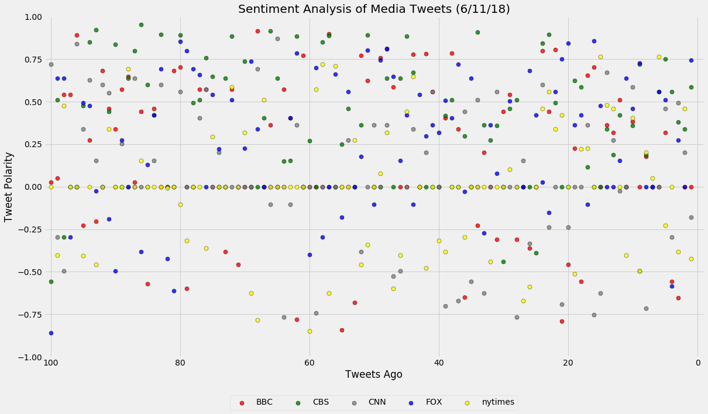
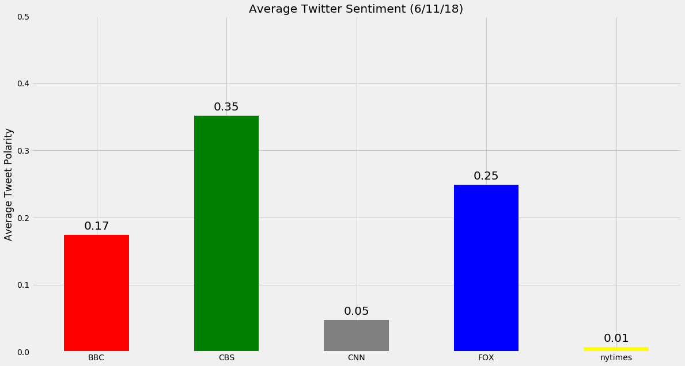

# Twitter Sentiments using Vader [BBC, CNN, CBS, FOX, NYtimes]
## 1. CNN and the New York Times is on average neutral in their published tweets
## 2. CBS is the most positive out of the five (.35)
## 3. BBC and FOX are more positive than [CNN and the NYtimes]  but less than CBS


```python
import tweepy
import numpy as np
import pandas as pd
from matplotlib import pylab
import matplotlib.pyplot as plt
from vaderSentiment.vaderSentiment import SentimentIntensityAnalyzer
from config import consumer_key, consumer_secret, access_token, access_token_secret
```


```python
# Get authenticated to pull data from Twitter
auth = tweepy.OAuthHandler(consumer_key, consumer_secret)
auth.set_access_token(access_token, access_token_secret)
```


```python
# Generate a list of 5 pages
pageNum = np.arange(1,6)
# Generate channel list
names = ['BBC', 'CBS', 'CNN', 'FOX', 'nytimes']
# Initialize API
api = tweepy.API(auth)
```


```python
# Get loop work for channel
final = {}
for x in names:
    result = []
    for y in pageNum:
        data = api.user_timeline(x, page = pageNum[y-1])
        for tweet in data:
            result.append(tweet.text)
        final[x] = result
```


```python
# Put everything into a data frame
df = pd.DataFrame(final)
# Generate tweets ago column
df.reset_index(inplace = True)
df['index'] += 1
df.sort_values(by='index', ascending=False, inplace = True)
df.head()
# Initialize VADER sentiment analysis
vader = SentimentIntensityAnalyzer()
```


```python
# Fill vader df
vader_df = {}
for x in names:
    result = []
    for y in (tweetsAgo - 1):
        result.append(vader.polarity_scores(df[x][y])['compound'])
    vader_df[x] = result
vaderDF = pd.DataFrame(vader_df)
```


```python
plt.style.use('fivethirtyeight')
plt.figure(figsize=(18,10))
colorm = ['red', 'green', 'grey', 'blue', 'yellow']
for i in range(len(names)):
    plt.scatter(x = df.index+1, y = vaderDF[names[i]], edgecolors = 'black', s = 50, alpha = .8, c = colorm[i])
pylab.legend(loc = 9, bbox_to_anchor = (0.5, -0.1), ncol = len(names))
plt.ylim(-1, 1)
plt.xlim(101, -1)
plt.xlabel('Tweets Ago')
plt.ylabel('Tweet Polarity')
plt.title('Sentiment Analysis of Media Tweets (6/11/18)')
plt.show()
```





```python
# Plot the figure.
plt.figure(figsize=(18,10))
ax = vaderDF.mean().plot(kind='bar', color = colorm)
ax.set_xticklabels(names, rotation = 0)
ax.set_ylim(0, .5)
ax.set_ylabel('Average Tweet Polarity')
ax.set_title('Average Twitter Sentiment (6/11/18)')

rects = ax.patches

# For each bar: Place a label
for rect in rects:
    # Get X and Y placement of label from rect.
    y_value = rect.get_height()
    x_value = rect.get_x() + rect.get_width() / 2

    # Number of points between bar and label. Change to your liking.
    space = 5
    # Vertical alignment for positive values
    va = 'bottom'

    # If value of bar is negative: Place label below bar
    if y_value < 0:
        # Invert space to place label below
        space *= -1
        # Vertically align label at top
        va = 'top'

    # Use Y value as label and format number with one decimal place
    label = "{:.2f}".format(y_value)

    # Create annotation
    plt.annotate(
        label,                      # Use `label` as label
        (x_value, y_value),         # Place label at end of the bar
        xytext=(0, space),          # Vertically shift label by `space`
        textcoords="offset points", # Interpret `xytext` as offset in points
        ha='center',                # Horizontally center label
        va=va, size = 20)           # Vertically align label differently for
                                    # positive and negative values.
plt.show()
```




